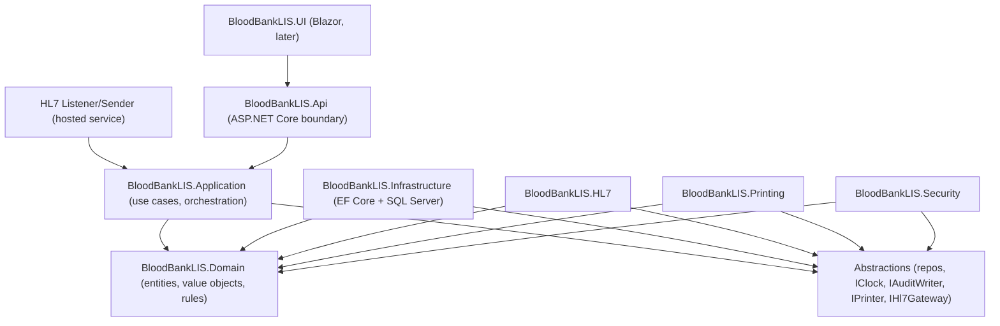

# Blood Bank LIS — Architecture

Status: Phase 0 (design only, no application code yet)
Platform: C# / .NET 8 (LTS), SQL Server, EF Core (code-first migrations)
UI direction: API-first (ASP.NET Core Web API as the boundary; Blazor web UI added in a later phase)
HL7: original in-house v2.x parser/generator

This document defines the layered architecture, dependency rules, bounded contexts, and cross-cutting concerns for the system. It is the parent reference for the other `docs/` files (`erd.md`, `workflows.md`, `safety-rules.md`, `hl7-design.md`, `printing-billing.md`, `validation-plan.md`, `traceability-matrix.md`, `risk-register.md`).

---

## 1. Guiding principles

- **Safety over speed.** Hard stops, mandatory checks, and audit are non-negotiable and take priority over development convenience.
- **No silent mutation of clinical data.** Corrections create new versioned records carrying a reason and electronic signature; original values are preserved and remain visible.
- **Business rules isolated from delivery mechanisms.** The compatibility/issue rule engine lives in the Domain layer and is the single source of truth, reused identically by the API, the HL7 interface, and any future desktop client.
- **Append-only history** for inventory status, clinical state, blood-type history, and audit. Clinical rows are never hard-deleted; they are voided/superseded.
- **Deterministic and testable.** Every safety rule is a pure function with no I/O, driven by inputs and an injected clock, so it can be exhaustively unit-tested for regulatory validation.
- **Clear over clever.** Readability and traceability win over terseness.

---

## 2. Layered architecture

Dependencies point inward. Domain depends on nothing; outer layers depend on inner abstractions.



### 2.1 Domain (`BloodBankLIS.Domain`)
- Depends on **nothing** external (no EF, no ASP.NET, no HL7).
- Contains entities (e.g. `Patient`, `Specimen`, `BloodUnit`), value objects (`AboRh`, `UnitNumber`, `AccessionNumber`, `Expiration`), enums (statuses, product types), domain events, and the **pure rule engine** (compatibility checks, expiration logic, status-transition guards).
- Rule functions return a structured outcome (see 4.3); they never throw to drive control flow and never read the clock or database directly.

### 2.2 Application (`BloodBankLIS.Application`)
- Orchestrates use cases as commands and queries (e.g. `IssueUnitCommand`, `VerifyResultCommand`, `SearchInventoryQuery`).
- Owns the **abstractions** the outer layers implement: repositories/unit-of-work, `IClock`, `IAuditWriter`, `IPrinter`, `IHl7Gateway`, `ICurrentUser`.
- Coordinates transactions so that the domain state change and its `AuditEvent` commit atomically.
- Enforces permission checks here (not in the UI), so the same rule applies to API and HL7 callers.
- No EF Core types, HL7 strings, or printer/ZPL details leak into this layer.

### 2.3 Infrastructure (`BloodBankLIS.Infrastructure`)
- Implements the Application abstractions using EF Core + SQL Server: `DbContext`, entity configurations, migrations, repositories, unit-of-work, and seed data.
- Owns concurrency handling via `RowVersion` and the transactional `IAuditWriter` implementation.

### 2.4 Satellite infrastructure projects
- **`BloodBankLIS.HL7`** — original v2.x tokenizer, segment/field/component models, message builders, and configurable field mapping. Implements `IHl7Gateway` and parsing services. Calls Application use cases; never executes business rules directly.
- **`BloodBankLIS.Printing`** — label/P-tag templates, ZPL renderer, print preview model, print-history support. Implements `IPrinter`. Receives a data model only; contains no business logic.
- **`BloodBankLIS.Security`** — authentication/authorization, electronic signature, and the audit writer wiring. Implements `IAuditWriter` persistence and permission evaluation.

### 2.5 Delivery
- **`BloodBankLIS.Api`** — ASP.NET Core Web API. Composition root (DI wiring), HTTP endpoints, auth middleware, request/response DTOs. Hosts the HL7 listener/sender as background hosted services.
- **`BloodBankLIS.UI`** — Blazor web client (later phase). Talks only to the Api over HTTP; holds no business rules.

---

## 3. Bounded contexts

| Context | Responsibility | Key tables (see `erd.md`) |
|---|---|---|
| Identity & Access | Users, roles, permissions, e-signature, audit | `Users`, `Roles`, `Permissions`, `AuditEvents` |
| Patient & Encounter | Demographics, identifiers, visits, comments/warnings | `Patients`, `PatientIdentifiers`, `Encounters` |
| Specimen & Order | Accessioning, order linkage, rejection | `Specimens`, `Orders`, `OrderSpecimens` |
| Testing & Results | Result entry, verification, correction | `Tests`, `TestResults`, `ResultComments` |
| Immunohematology History | ABO/Rh, antibody, antigen profile | `PatientBloodTypeHistory`, `AntibodyHistory`, `AntigenProfiles` |
| Inventory | Units, attributes, location, status history, modification | `BloodProducts`, `ProductTypes`, `InventoryStatusHistory` |
| Compatibility & Issuing | Crossmatch, allocation, issue, return, emergency release | `Crossmatches`, `Allocations`, `Issues`, `Returns`, `Overrides` |
| Transfusion & Reaction | Transfusion documentation, reaction investigation | `TransfusionEvents`, `ReactionInvestigations` |
| Billing | Charge rules, test/service and product catalogs, charge events, review queue, DFT queue | `ChargeCodes`, `ChargeRules`, `TestServiceBillings`, `ProductBillings`, `BillingEvents` |
| Interfaces | HL7 messaging, endpoints, error queue | `HL7Messages`, `InterfaceEndpoints`, `InterfaceErrorQueue` |
| Printing | Labels, P-tags, print history | `PrintJobs` |
| System Configuration | Facility/config values, mapping config | `SystemConfiguration` |

Contexts communicate through the Application layer and domain events; they do not reach into each other's tables directly outside their owning services.

---

## 4. Cross-cutting concerns

### 4.1 Audit
- `IAuditWriter` is invoked **inside the same database transaction** as every create/update/verify/issue/return/discard/override/reprint operation. If the audit write fails, the business operation rolls back.
- Each `AuditEvent` captures: event type, entity type + id, actor (user), workstation, UTC timestamp, old value, new value, reason (where applicable), and electronic-signature reference (where applicable).
- Audit is **read-only** after write — no update/delete path is exposed.

### 4.2 Authorization
- Permission-based, not role-string comparisons. Roles aggregate permissions; checks evaluate the required permission for a use case.
- Enforced in the Application layer via a guard at the start of each command/query, so API and HL7 entry points are equally protected.

### 4.3 Rule-outcome model
- Rule evaluation returns a structured `RuleEvaluation` with one of three severities:
  - **HardStop** — operation is blocked and cannot be overridden.
  - **Warning** — overridable only with reason + authorization + e-signature + audit.
  - **Pass** — no objection.
- A single evaluation aggregates many individual rule results, each with a stable code and message, so the UI can show exactly which checks failed and why. The engine never auto-downgrades a HardStop to a Warning.

### 4.4 Clock
- `IClock` provides UTC `Now`. All expiration and time-window logic reads the clock through this abstraction so tests are deterministic. Production uses a system clock; tests inject a fixed clock.

### 4.5 Concurrency and soft state
- Clinical tables carry a `RowVersion` for optimistic concurrency.
- State changes are recorded in append-only history tables (`InventoryStatusHistory`, `PatientBloodTypeHistory`, etc.) rather than overwriting prior state.

---

## 5. Technology choices and rationale

| Decision | Choice | Rationale |
|---|---|---|
| Runtime | .NET 8 (LTS) | Long-term support for a regulated system. |
| Persistence | SQL Server + EF Core code-first | Migrations, constraints, indexes in source control; matches requirement. |
| Boundary | ASP.NET Core Web API | Reusable by web and future desktop clients; clean seam for auth + audit. |
| UI (later) | Blazor web | Shares C# models with the API; defers desktop/web duplication. |
| HL7 | In-house v2.x | Full control over parsing/validation behavior in a safety-critical context. |
| Labels | ZPL templates | Industry-standard for thermal label printers; previewable. |
| Tests | xUnit + deterministic clock | Pure-rule tests run without infrastructure for fast, exhaustive validation. |

---

## 6. Project structure

```
BloodBankLIS.sln
src/
  BloodBankLIS.Domain/
  BloodBankLIS.Application/
  BloodBankLIS.Infrastructure/
  BloodBankLIS.HL7/
  BloodBankLIS.Printing/
  BloodBankLIS.Security/
  BloodBankLIS.Api/
  BloodBankLIS.UI/            (Blazor, later phase)
tests/
  BloodBankLIS.Domain.Tests/
  BloodBankLIS.Application.Tests/
  BloodBankLIS.HL7.Tests/
  BloodBankLIS.Integration.Tests/
docs/
  architecture.md, erd.md, workflows.md, safety-rules.md,
  hl7-design.md, printing-billing.md,
  validation-plan.md, traceability-matrix.md, risk-register.md
```

The solution skeleton is created in Phase 1, not Phase 0.
