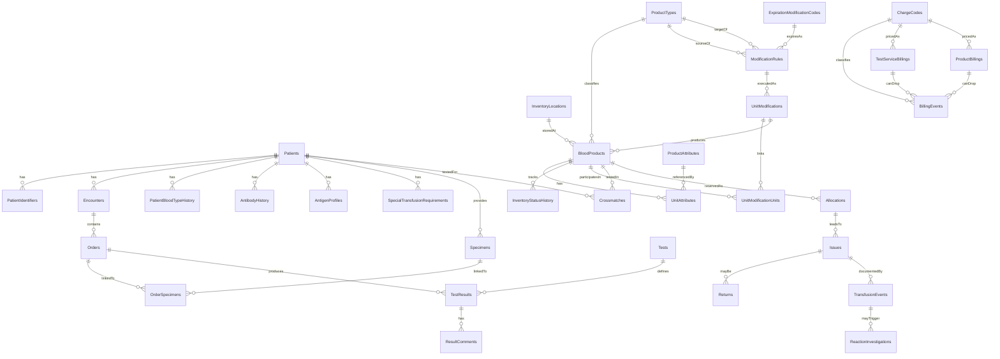

# Blood Bank LIS — Data Model (ERD)

Status: Phase 0 (design). Column lists are the target schema; exact CLR/SQL types are finalized when EF Core configurations and migrations are written in Phase 1+.

## Conventions

- **Surrogate PK**: every table has `Id BIGINT IDENTITY` unless noted. Source/natural identifiers (MRN, accession number, unit number, order id, visit number) are preserved as their own columns with unique indexes.
- **Audit metadata** on every clinical/operational table: `CreatedUtc DATETIME2`, `CreatedBy BIGINT (Users.Id)`, `ModifiedUtc DATETIME2 NULL`, `ModifiedBy BIGINT NULL`, `RowVersion ROWVERSION` (optimistic concurrency).
- **No hard deletes for clinical data.** Use status columns and append-only history tables. Reference/config tables may use an `IsActive`/`IsRetired` flag instead of deletion.
- **Time**: stored as UTC `DATETIME2`. Expiration of products is tracked to date+time. ISBT 128 also stores facility-local expiration (`ExpirationLocal` + `ExpirationTimezone` + `ExpirationHasExplicitTime`) — see `docs/isbt128-module.md`.
- **Money**: `DECIMAL(18,2)`.
- All FK columns are indexed.

---

## 1. Identity, Access, Audit, Config

### Users
`Id`, `UserName` (unique), `DisplayName`, `Email`, `PasswordHash`, `IsActive`, `IsLocked`, `LastLoginUtc`, audit metadata.

### Roles
`Id`, `Name` (unique), `Description`, `IsActive`, `SecurityLevel` (int; max across a user's roles gates exception overrides).

### Permissions
`Id`, `Code` (unique, e.g. `inventory.issue`), `Description`.

### RolePermissions
`Id`, `RoleId` (FK Roles), `PermissionId` (FK Permissions). Unique (`RoleId`,`PermissionId`).

### UserRoles
`Id`, `UserId` (FK Users), `RoleId` (FK Roles). Unique (`UserId`,`RoleId`).

### ExceptionDefinitions
`Id`, `RuleCode` (unique, e.g. `RES-ABORH-DELTA`), `Name`, `Description`, `MinSecurityLevel`, `IsOverridable`, `IsActive`, audit metadata. Admin catalog for clinical exception override gates.

### ElectronicSignatures
`Id`, `UserId` (FK Users), `Action` (e.g. `IssueOverride`), `ContextType`, `ContextId`, `SignedUtc`, `MeaningOfSignature`, `Workstation`. Append-only.

### AuditEvents
`Id`, `EventType` (Create/Update/Verify/Issue/Return/Discard/Override/Reprint/...), `EntityType`, `EntityId`, `UserId` (FK Users), `Workstation`, `OccurredUtc`, `OldValueJson NVARCHAR(MAX) NULL`, `NewValueJson NVARCHAR(MAX) NULL`, `Reason NVARCHAR(MAX) NULL`, `SignatureId BIGINT NULL` (FK ElectronicSignatures). Append-only; no update/delete path.
Indexes: (`EntityType`,`EntityId`), (`UserId`), (`OccurredUtc`), (`EventType`).

### SystemConfiguration
`Id`, `Key` (unique), `Value NVARCHAR(MAX)`, `Category`, `Description`, `IsSensitive`, audit metadata. Holds facility-specific values (never hard-coded in business logic).

---

## 2. Patient & Encounter

### Patients
`Id`, `MedicalRecordNumber` (MRN, unique), `LastName`, `FirstName`, `MiddleName NULL`, `DateOfBirth DATE`, `Sex`, `Deceased BIT`, `DeceasedUtc NULL`, `Status` (Active/Merged/Inactive), `MergedIntoPatientId BIGINT NULL` (self-FK; merges never delete), audit metadata.
Indexes: unique(`MedicalRecordNumber`), (`LastName`,`FirstName`,`DateOfBirth`).

### PatientIdentifiers
`Id`, `PatientId` (FK Patients), `IdentifierType` (MRN/SSN/MemberId/Other), `Value`, `AssigningAuthority NULL`, `IsActive`. Unique (`IdentifierType`,`Value`,`AssigningAuthority`).
Index: (`Value`).

### Encounters
`Id`, `PatientId` (FK Patients), `VisitNumber` (preserved source id, unique per facility), `AccountNumber NULL`, `EncounterType` (Inpatient/Outpatient/ED), `AttendingProvider NULL`, `Location NULL`, `AdmitUtc NULL`, `DischargeUtc NULL`, `Status`, audit metadata.
Index: unique(`VisitNumber`), (`PatientId`).

### PatientComments
`Id`, `PatientId` (FK Patients), `CommentType` (Comment/Warning), `Severity` (Info/Warning/Critical), `Text`, `IsActive`, `EnteredBy`, audit metadata.

### SpecialTransfusionRequirements
`Id`, `PatientId` (FK Patients), `RequirementType` (Irradiated/CMVNegative/Leukoreduced/Washed/AntigenNegative/Other), `AntigenCode NULL` (for antigen-negative requirements), `Reason`, `EffectiveUtc`, `ExpiresUtc NULL`, `IsActive`, `EnteredBy`, audit metadata.
Index: (`PatientId`,`IsActive`).

---

## 3. Immunohematology History (append-only)

### PatientBloodTypeHistory
`Id`, `PatientId` (FK Patients), `Abo` (A/B/AB/O/Unknown), `RhD` (Pos/Neg/Unknown/WeakD), `Source` (TestResult/HL7/ManualEntry/HistoricalImport), `SourceResultId BIGINT NULL` (FK TestResults), `RecordedUtc`, `RecordedBy`, `IsCurrent BIT`, `Reason NULL` (required for manual edits). Append-only; corrections add a new row and flip `IsCurrent`.
Index: (`PatientId`,`IsCurrent`).

### AntibodyHistory
`Id`, `PatientId` (FK Patients), `AntibodySpecificity` (e.g. anti-K, anti-E), `Status` (Identified/Suspected/HistoricalOnly), `IdentifiedUtc`, `IdentifiedBy`, `SourceResultId BIGINT NULL` (FK TestResults), `IsActive BIT`, `Comment NULL`. Append-only; never silently removed (deactivation requires reason + audit).
Index: (`PatientId`,`IsActive`).

### AntigenProfiles
`Id`, `PatientId` (FK Patients), `AntigenCode` (e.g. K, Fya, Jkb), `Result` (Positive/Negative/NotTested), `Method`, `TestedUtc`, `TestedBy`, `SourceResultId NULL`. Index: (`PatientId`,`AntigenCode`).

---

## 4. Specimen & Order

### Specimens
`Id`, `AccessionNumber` (preserved source id, unique), `PatientId` (FK Patients), `EncounterId BIGINT NULL` (FK Encounters), `SpecimenType` (e.g. EDTA whole blood), `Barcode`, `CollectedUtc`, `ReceivedUtc NULL`, `ExpiresUtc NULL` (computed per rule; see safety-rules), `DrawLocation NULL`, `CollectorId NULL`, `Status` (Collected/Received/Accepted/Rejected/Expired/Cancelled), `RejectionReason NULL`, audit metadata.
Indexes: unique(`AccessionNumber`), (`PatientId`), (`Barcode`), (`ExpiresUtc`), (`Status`).

### Orders
`Id`, `OrderId` (preserved source/placer id, unique), `PatientId` (FK Patients), `EncounterId NULL` (FK Encounters), `OrderType` (TypeAndScreen/Crossmatch/AntibodyId/...), `OrderingProvider NULL`, `Priority` (Routine/STAT), `Status` (New/InProcess/Completed/Cancelled), `OrderedUtc`, `Source` (HL7/Manual), audit metadata.
Indexes: unique(`OrderId`), (`PatientId`), (`Status`).

### OrderSpecimens
`Id`, `OrderId` (FK Orders), `SpecimenId` (FK Specimens). Unique (`OrderId`,`SpecimenId`).

---

## 5. Testing & Results

### Tests (catalog)
`Id`, `Code` (unique, e.g. ABORH, ABSC, ABID, DAT, XM, AGTYPE), `Name`, `Category`, `ResultDataType` (Coded/Text/Numeric), `IsActive`.

### TestResults (versioned)
`Id`, `OrderId NULL` (FK Orders), `SpecimenId` (FK Specimens), `PatientId` (FK Patients), `TestId` (FK Tests), `Version INT` (1..n), `SupersededByResultId BIGINT NULL` (self-FK), `Value`, `Units NULL`, `Interpretation NULL`, `Status` (Pending/Entered/Verified/Corrected), `EnteredBy`, `EnteredUtc`, `VerifiedBy NULL`, `VerifiedUtc NULL`, `CorrectionReason NULL`, audit metadata. Corrections create a new version; prior rows are preserved and marked superseded.
Indexes: (`SpecimenId`,`TestId`), (`PatientId`), (`Status`).

### ResultComments
`Id`, `TestResultId` (FK TestResults), `CommentType` (General/Critical/Warning), `Text`, `EnteredBy`, audit metadata.

---

## 6. Inventory

### ProductTypes
`Id`, `ProductCode` (unique; ISBT 128 product code where applicable), `Name`, `ComponentClass` (RBC/Plasma/Platelet/Cryo/WholeBlood/Other), `DefaultShelfLifeHours INT NULL`, `RequiresCrossmatch BIT`, `IsActive`.

### ProductAttributes (reference)
`Id`, `Code` (unique; Irradiated/CMVNegative/Leukoreduced/Washed/Frozen/Thawed/Pooled/Aliquoted), `Name`, `IsActive`.

### BloodProducts (unit record)
`Id`, `UnitNumber` (donation/DIN, preserved source id, unique), `ProductTypeId` (FK ProductTypes), `Abo`, `RhD`, `Isbt128ProductCode NULL`, `Isbt128DonationId NULL`, `CollectionFacility NULL`, `SupplierId NULL`, `CollectedUtc NULL`, `ExpiresUtc DATETIME2`, `Volume DECIMAL NULL`, `CurrentLocationId BIGINT NULL` (FK InventoryLocations), `Status` (Expected/Received/Quarantine/Available/Allocated/Issued/Transfused/Returned/ReturnedToSupplier/Discarded/Expired/OnHold/Missing/Damaged), `ShipmentId NULL`, `QuarantineReason NULL`, `HoldReason NULL`, `MissingReason NULL`, `DamagedReason NULL`, `SupplierReturnReason NULL`, `DiscardReason NULL`, `ReceiveVisualAcceptable BIT`, `ReceiveVisualNotes NULL`, `ReceiveAppearance INT` (Acceptable/Clots/Hemolysis/Discoloration/Lipemia/Leaking/LabelIllegible/OtherDefect), `ReceiveTemperatureCelsius DECIMAL(18,1) NULL`, `DonationRestriction INT` (Allogeneic/Autologous/Directed), `ReservedPatientId BIGINT NULL` (intended recipient when autologous/directed), audit metadata.
Indexes: unique(`UnitNumber`), (`Status`), (`ExpiresUtc`), (`ProductTypeId`), (`Abo`,`RhD`), (`CurrentLocationId`).

### UnitAttributes (link)
`Id`, `BloodProductId` (FK BloodProducts), `ProductAttributeId` (FK ProductAttributes), `AppliedUtc`, `AppliedBy`. Unique (`BloodProductId`,`ProductAttributeId`).

### InventoryLocations
`Id`, `Code` (unique), `Name`, `LocationType` (Refrigerator/Freezer/Issue/Transit/External), `IsActive`.

### InventoryStatusHistory (append-only)
`Id`, `BloodProductId` (FK BloodProducts), `FromStatus NULL`, `ToStatus`, `FromLocationId NULL`, `ToLocationId NULL`, `Reason NULL`, `ChangedBy`, `ChangedUtc`, `RelatedEntityType NULL`, `RelatedEntityId NULL`.
Index: (`BloodProductId`,`ChangedUtc`).

### Product modification (implemented)

Every modification (Divide, Pool, Irradiate, Thaw, Volume Reduction, Leukoreduction) is executed under an admin-configured `ModificationRules` row, retires its source unit(s) into the terminal `Modified` status, and produces new result unit(s) in `Quarantine`. See `docs/workflows.md` §"Product modification" and `docs/safety-rules.md`.

#### ExpirationModificationCodes (admin config)
`Id`, `Code` (unique, e.g. `24H`, `28D`, `42D`), `OffsetAmount`, `OffsetUnit` (Hours/Days), `RelativeTo` (`ModificationDateTime` / `CollectionDateTime`), `Description NULL`, `IsActive`, `Version`, audit metadata.
Indexes: (`Code` unique), (`IsActive`).

#### ModificationRules (admin config)
`Id`, `ModificationCode` (unique, e.g. `IRR-RBC-LR`), `SourceProductTypeId` (FK ProductTypes), `ModificationType` (Divide/Pool/Irradiate/Thaw/VolumeReduction/Leukoreduction/Wash), `TargetProductTypeId` (FK ProductTypes), `ExpirationModificationCodeId` (FK ExpirationModificationCodes), `Description NULL`, `IsActive`, `Version`, audit metadata. Admin and modify screens display each product's ISBT description code (`ProductTypes.Isbt128ProductCode`, e.g. `E0336`) when one is configured.
Indexes: (`ModificationCode` unique), (`SourceProductTypeId`,`ModificationType`,`TargetProductTypeId`), (`ExpirationModificationCodeId`), (`IsActive`). App-layer guard prevents more than one **active** rule per (`SourceProductTypeId`,`ModificationType`,`TargetProductTypeId`) triple.

#### UnitModifications (header, append-only)
`Id`, `ModificationRuleId` (FK ModificationRules), `ModificationType` (denormalized), `ExpirationOffsetCodeApplied` (denormalized snapshot of the expiration code), `ResultExpiresUtc` (= `min(anchor + offset, earliest source ExpiresUtc)` where the anchor is modification time or the earliest source collection time), `Reason`, `PerformedBy`, `PerformedUtc`, audit metadata.
Indexes: (`ModificationRuleId`), (`PerformedUtc`).

#### UnitModificationUnits (link, append-only)
`Id`, `UnitModificationId` (FK UnitModifications), `BloodProductId` (FK BloodProducts), `Role` (`Source`/`Result`), `SortOrder`, audit metadata. Multiple `Source` rows for a Pool; multiple `Result` rows for a Divide.
Indexes: (`UnitModificationId`), (`BloodProductId`).

#### BloodProducts.DerivedFromModificationId
Nullable FK BloodProducts → UnitModifications, set on result units so "how was this unit produced" is an O(1) lookup. Null for units received directly into inventory.

---

## 7. Compatibility & Issuing

### CompatibilityTests
`Id`, `PatientId` (FK Patients), `SpecimenId` (FK Specimens), `Method` (Serologic/Electronic/ImmediateSpin/AHG), `PerformedUtc`, `PerformedBy`, `Result` (Compatible/Incompatible/NotPerformed), `Comment NULL`. Index: (`PatientId`,`SpecimenId`).

### Crossmatches
`Id`, `BloodProductId` (FK BloodProducts), `PatientId` (FK Patients), `SpecimenId` (FK Specimens), `Method`, `Result` (Compatible/Incompatible), `PerformedUtc`, `PerformedBy`, `ExpiresUtc NULL`, `Comment NULL`.
Indexes: (`BloodProductId`), (`PatientId`,`SpecimenId`).

### Allocations (reservation)
`Id`, `BloodProductId` (FK BloodProducts), `PatientId` (FK Patients), `SpecimenId BIGINT NULL` (FK Specimens), `Status` (Reserved/Released/Consumed/Expired), `AllocatedUtc`, `AllocatedBy`, `ExpiresUtc NULL`, `ReleaseReason NULL`. A unit may have at most one active (`Reserved`) allocation.
Indexes: (`BloodProductId`,`Status`), (`PatientId`).

### Issues
`Id`, `AllocationId BIGINT NULL` (FK Allocations), `BloodProductId` (FK BloodProducts), `PatientId` (FK Patients), `IssuedToLocation`, `IssuedTo` (recipient/courier), `IssuedUtc`, `IssuedBy`, `IssueType` (Standard/EmergencyRelease/MassiveTransfusion), `OverrideId BIGINT NULL` (FK Overrides), `Status` (Issued/Returned/Transfused), `WardReceivedUtc NULL`, `WardReceivedBy NULL`, `WardVisualAcceptable BIT`, `WardScanJson NULL`, `CoolerId NULL`, `InTransitDueUtc NULL`, `TestsIncompleteAtIssue BIT`, `RetrospectiveCrossmatchDueUtc NULL`, `RetrospectiveCrossmatchCompletedUtc NULL`, `RetrospectiveCrossmatchId BIGINT NULL`. Index: (`BloodProductId`), (`PatientId`), (`TestsIncompleteAtIssue`,`RetrospectiveCrossmatchCompletedUtc`), (`Status`,`WardReceivedUtc`).

### Returns
`Id`, `IssueId` (FK Issues), `BloodProductId` (FK BloodProducts), `ReturnedUtc`, `ReturnedBy`, `Reason`, `ReissueEligible BIT`, `ReissueEvaluationJson NULL` (which checks passed/failed). Index: (`IssueId`).

### Overrides
`Id`, `Action` (EmergencyRelease/WarningOverride), `ContextType`, `ContextId`, `RuleCode`, `Reason`, `AuthorizedBy` (FK Users), `SignatureId` (FK ElectronicSignatures), `OverriddenUtc`, `Resolution NVARCHAR(50) NULL` (e.g. Retain/Replace for result-context ABO/Rh delta). Append-only. Index: (`ContextType`,`ContextId`).

---

## 8. Transfusion & Reaction

### TransfusionEvents
`Id`, `IssueId` (FK Issues), `BloodProductId` (FK BloodProducts), `PatientId` (FK Patients), `StartUtc NULL`, `StopUtc NULL`, `VolumeTransfused DECIMAL NULL`, `TransfusionistId NULL`, `VitalsJson NULL` (placeholder structure), `ReactionSuspected BIT`, `FinalDisposition` (Completed/Stopped/Wasted/Returned), `DocumentedBy`, audit metadata. Index: (`PatientId`), (`IssueId`).

### ReactionInvestigations
`Id`, `TransfusionEventId` (FK TransfusionEvents), `PatientId` (FK Patients), `ReportedUtc`, `ReportedBy`, `ReactionType NULL`, `Severity NULL`, `Findings NULL`, `ClericalCheckCompleted`, `VisualInspectionCompleted`, `DatResult` (NotRecorded/Negative/Positive/NotPerformed), `ElutionResult NULL`, `RemainderQuarantined`, `Status` (Open/UnderReview/Closed), `Disposition NULL`. Index: (`TransfusionEventId`).

---

## 9. Billing

### ChargeCodes
`Id`, `Code` (unique, internal), `CptCode NULL` (placeholder mapping), `Description`, `DefaultAmount DECIMAL NULL`, `IsActive`.

### TestServiceBillings
`Id`, `ChargeCodeId` (FK ChargeCodes), `Description NULL`, `Trigger` (TestVerified), `TestCode`, `IsActive`. Unique (`Trigger`, `TestCode`, `ChargeCodeId`).

### ProductBillings
`Id`, `ChargeCodeId` (FK ChargeCodes), `Description NULL`, `Trigger` (UnitIssued), `IsbtProductCode` (ISBT PDC), `IsActive`. Unique (`Trigger`, `IsbtProductCode`, `ChargeCodeId`).

### BillingEvents
`Id`, `ChargeCodeId NULL` (FK ChargeCodes), `BillingCode`, `PatientId` (FK Patients), `TriggerType` (TestVerified/UnitIssued/Procedure/...), `TriggerEntityType`, `TriggerEntityId`, `SourceKind` (ChargeRule/TestService/Product), `SourceId`, `Hl7MessageId NULL`, `DedupeKey` (unique), `Amount DECIMAL NULL`, `Status` (Pending/Reviewed/Exported/Cancelled), `CreatedBy`, `CancelReason NULL`, audit metadata.
Indexes: unique(`DedupeKey`), (`Status`), (`PatientId`), (`SourceKind`, `SourceId`).

---

## 10. Interfaces (HL7)

### InterfaceEndpoints
`Id`, `Name` (unique), `Direction` (Inbound/Outbound), `Transport` (MLLP/File), `Host NULL`, `Port NULL`, `Path NULL`, `MessageTypes` (e.g. ADT,ORM,ORU), `MappingProfile NULL`, `IsEnabled`, audit metadata.

### HL7Messages
`Id`, `EndpointId BIGINT NULL` (FK InterfaceEndpoints), `Direction`, `MessageType`, `TriggerEvent NULL`, `MessageControlId`, `RawMessage NVARCHAR(MAX)`, `ParsedJson NVARCHAR(MAX) NULL`, `Status` (Received/Processed/Errored/Acked/Nacked/Replayed), `ReceivedUtc`, `ProcessedUtc NULL`, `AckCode NULL`, `ErrorDetail NULL`, `RetryCount INT`. 
Indexes: (`MessageControlId`), (`Status`), (`ReceivedUtc`), (`MessageType`).

### InterfaceErrorQueue
`Id`, `HL7MessageId` (FK HL7Messages), `ErrorType`, `ErrorDetail`, `NextRetryUtc NULL`, `RetryCount INT`, `Resolved BIT`, `ResolvedBy NULL`, `ResolvedUtc NULL`. Index: (`Resolved`,`NextRetryUtc`).

---

## 11. Printing

### PrintJobs
`Id`, `JobType` (SpecimenLabel/CompatibilityTag/ProductLabel/Armband), `TemplateCode`, `TargetPrinter`, `ContextType`, `ContextId`, `PayloadJson NVARCHAR(MAX)` (data model rendered), `RenderedZpl NVARCHAR(MAX) NULL`, `Status` (Queued/Printed/Failed), `IsReprint BIT`, `ReprintReason NULL`, `PrintedBy`, `PrintedUtc NULL`, audit metadata.
Indexes: (`ContextType`,`ContextId`), (`Status`).

---

## 12. Index summary (common lookups)

| Field | Tables |
|---|---|
| MRN | `Patients.MedicalRecordNumber`, `PatientIdentifiers.Value` |
| Accession number | `Specimens.AccessionNumber` |
| Unit number | `BloodProducts.UnitNumber` |
| Patient id | most clinical tables (FK) |
| Specimen id | `TestResults`, `Crossmatches`, `Allocations` |
| Order id | `Orders.OrderId` |
| Inventory status | `BloodProducts.Status` |
| Expiration | `BloodProducts.ExpiresUtc`, `Specimens.ExpiresUtc` |
