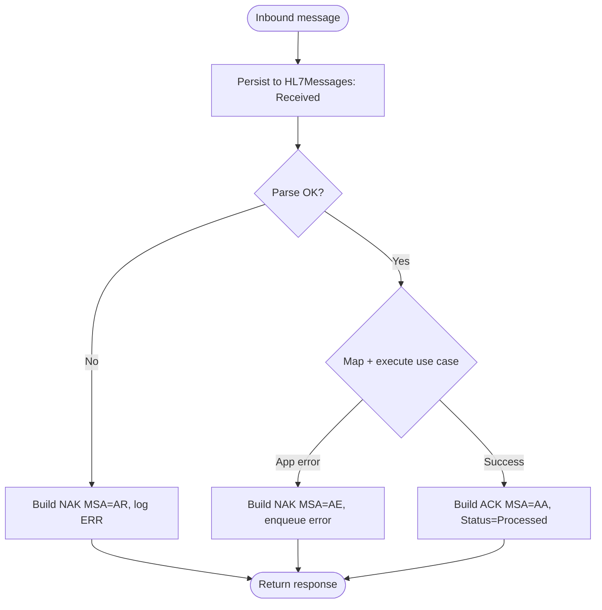

# Blood Bank LIS — HL7 Interface Design

Status: Implemented in Phase 5. The HL7 layer (`BloodBankLIS.HL7`) is an **original, in-house** HL7 v2.x parser/generator. It is fully isolated from business logic: it parses/serializes messages and maps fields, but all clinical actions go through the same Application use cases the API uses, so the safety checks in `safety-rules.md` always apply.

Scope for the project: inbound **ADT** (demographics/encounter) and **ORM/OML** (orders); outbound **ORU** (results) and a standard outbound **DFT^P03** (billing). MLLP send of outbound DFT (and ORU) remains a later-phase transport item.

---

## 1. Parser/generator design

### 1.1 Tokenizing
- Read encoding characters from `MSH-1` (field separator, default `|`) and `MSH-2` (component `^`, repetition `~`, escape `\`, subcomponent `&`). Never hard-code separators; honor what the message declares.
- Structure: `Message -> Segment[] -> Field[] -> Repetition[] -> Component[] -> Subcomponent[]`.
- Preserve the raw message verbatim alongside the parsed structure (stored in `HL7Messages.RawMessage`).

### 1.2 Object model (in `BloodBankLIS.HL7`)
- `Hl7Message`, `Hl7Segment`, `Hl7Field` with safe accessors like `Get("PID-3-1")` returning empty string (not null/exception) for missing fields.
- Builders (`Hl7MessageBuilder`) for outbound messages that apply the configured encoding characters and escape rules.
- Pure functions; no database or network access in this project. Network transport lives in the Api hosted services.

### 1.3 Validation
- Structural validation: required segments present (e.g. MSH, PID), `MSH-9` message type recognized, `MSH-10` control id present.
- Semantic mapping validation happens in the mapping layer; failures produce a NAK with a meaningful `ERR`/`MSA` text.

---

## 2. Message mapping (configurable, not hard-coded)

Field mappings and facility constants live in `InterfaceEndpoints.MappingProfile` and `SystemConfiguration`, so the same parser serves different facilities.

### 2.1 Inbound ADT (A01 admit, A04 register, A08 update)
| HL7 | Maps to |
|---|---|
| `PID-3` | `PatientIdentifiers` (MRN + alternates with assigning authority) |
| `PID-5` | name (last/first/middle) |
| `PID-7` | date of birth |
| `PID-8` | sex |
| `PV1-19` | `Encounters.VisitNumber` |
| `PV1-2` | encounter type |
| `PV1-3` | location |

Action: `UpsertPatientFromHl7Command` / `UpsertEncounterFromHl7Command`. Demographics updates never overwrite clinical immunohematology history.

### 2.2 Inbound ORM/OML (orders)
| HL7 | Maps to |
|---|---|
| `ORC-1` | order control (NW new, CA cancel) |
| `ORC-2` / `OBR-2` | placer order id -> `Orders.OrderId` |
| `OBR-4` | universal service id -> order type |
| `SPM` / `OBR-15` | specimen + collection info |

Action: `CreateOrderFromHl7Command` / `CancelOrderFromHl7Command`.

### 2.3 Outbound ORU (results)
Triggered when a `TestResult` is verified (`VerifyResultCommand` raises a domain event). Builds `MSH + PID + OBR + OBX[]` from verified results and sends via the configured outbound endpoint. Stored in `HL7Messages` with direction Outbound.

### 2.4 Outbound DFT (billing)
Triggered when charge capture creates a `BillingEvent` (charge rule and/or test/service or product billing catalog). Builds a standard `MSH + EVN + PID + FT1` DFT^P03. `FT1-6` is `CG`, `FT1-7` is the billing code, `FT1-4` is the service date. Transaction amount (`FT1-10`) is left empty — catalog price is internal only. Stored in `HL7Messages` with direction Outbound, `MessageType=DFT`, `TriggerEvent=P03`.

---

## 3. ACK/NAK handling

- `MSA-1` codes: `AA` (accept), `AE` (application error), `AR` (reject).
- ACK `MSA-2` echoes the inbound `MSH-10` control id.
- Application errors that are retryable go to `InterfaceErrorQueue` (AE); structural rejects (AR) are logged but not retried automatically.

---

## 4. Reliability: transport, retry, replay

- **Transport**: MLLP over TCP (framing bytes 0x0B ... 0x1C 0x0D). Configurable host/port per `InterfaceEndpoints`. File-drop transport is supported as an alternative.
- **Hosted services** in `BloodBankLIS.Api`: an inbound MLLP listener and an outbound sender, both thin adapters that call `BloodBankLIS.HL7` for parse/build and the Application layer for actions.
- **Retry**: failed outbound sends and retryable inbound processing use exponential backoff with `RetryCount` and `NextRetryUtc` in `InterfaceErrorQueue`.
- **Replay**: any stored message in `HL7Messages` can be re-submitted through the same pipeline (`ReplayMessageCommand`); replays are marked `Replayed` and audited. Idempotency is protected by `MessageControlId` plus business-key checks so replays do not duplicate orders/patients.

---

## 5. Logging and observability

- Every message (in/out) is persisted with raw text, parsed JSON, status, timestamps, ack code, and error detail.
- `InterfaceErrorQueue` is the operational work list for interface failures, with resolve/replay actions that are audited.
- Indexes on `MessageControlId`, `Status`, `ReceivedUtc`, `MessageType` support the error-queue and replay UIs.

---

## 6. Endpoint configuration

`InterfaceEndpoints`: name, direction, transport, host/port or path, supported message types, mapping profile, enabled flag. No facility-specific values (sending/receiving application/facility, MRN assigning authority, etc.) are hard-coded; all live in configuration so deployments differ only by data.
