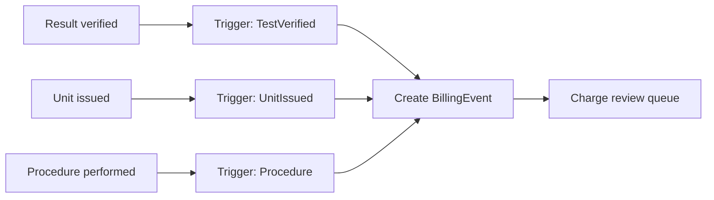

# Blood Bank LIS — Printing and Billing Design

Status: Part A (Printing) implemented in Phase 6. Part B (Billing) implemented in Phase 7 (HL7 DFT/batch export remains a documented placeholder).

---

# Part A — Printing (`BloodBankLIS.Printing`)

The printing layer is fully isolated from business logic. Services pass a **data model** (a plain DTO) to the printing layer; the printing layer owns layout, template selection, and rendering. No business rule, query, or clinical decision lives in a template.

## A.1 Artifacts

| Artifact | Phase | Notes |
|---|---|---|
| Specimen label | 6 | Accession number + barcode, patient identifiers, collection date/time |
| Compatibility tag / P-tag | 6 | Patient + unit + ABO/Rh + crossmatch status + expiration; emergency marking when applicable |
| Blood product label | placeholder | ISBT 128 fields; later phase |
| Patient armband | placeholder | later phase |

## A.2 Rendering

- Renderer target: **ZPL** for thermal label printers, behind an `ILabelRenderer` abstraction so other renderers (PDF preview) can be added.
- Templates are identified by `TemplateCode` and selected via configuration, not code branches.
- **Print preview**: every job can render to a preview model (and a PDF/PNG proof) before physical printing.

## A.3 Controls and audit

- All print activity is recorded in `PrintJobs` (job type, template, target printer, context, payload JSON, rendered ZPL, status, timestamps).
- **Reprint requires a reason** and produces a `Reprint` audit event; `PrintJobs.IsReprint` + `ReprintReason` are set. Reprinting a compatibility tag is a dangerous action (see `safety-rules.md`).
- Printer configuration (device names, endpoints, default templates) lives in `SystemConfiguration`; no printer specifics are hard-coded.

## A.4 P-tag data contract (Phase 4 produces the data; Phase 6 prints it)

The P-tag data model includes: patient name + MRN + DOB, patient ABO/Rh, unit number, unit ABO/Rh, product type, crossmatch method + result, unit expiration, issue date/time, issuer, and an emergency/uncrossmatched flag. The model is generated by the issue workflow so the printed tag always reflects the audited issue record.

---

# Part B — Billing (`BloodBankLIS.Application` + data in Infrastructure)

Charge capture is event-driven and isolated from clinical decisions: clinical use cases emit billing triggers; a billing service translates triggers into `BillingEvents`.

## B.1 Charge rules

- `ChargeCodes` map internal codes to descriptions, default amounts, and a **CPT mapping placeholder** (`CptCode`).
- Charge rules associate a trigger type (test verified, unit issued, procedure, specific issue event) with one or more charge codes; rules are data, not hard-coded.

## B.2 Trigger events

- Triggers are raised by Application use cases after the clinical action commits, so a charge is never created for a failed/blocked action.

## B.3 Duplicate prevention

- Each `BillingEvent` carries a deterministic `DedupeKey` (e.g. `triggerType + triggerEntityType + triggerEntityId + serviceDate`) with a **unique constraint**. A repeated trigger for the same event cannot create a second charge.

## B.4 Review queue and export

- `BillingEvents.Status`: `Pending -> Reviewed -> Exported` (or `Cancelled`).
- A **charge review queue** lets billing staff review/approve/cancel pending charges; create and cancel both write audit events (`Create`/`Update` with reason).
- **Export placeholder**: a future phase emits HL7 **DFT** (or a batch file) for reviewed charges; the model and status flow are designed now so export is additive.

## B.5 Audit

- Charge creation and cancellation are audited with old/new values and (for cancellation) a reason. No charge is silently created or removed.
