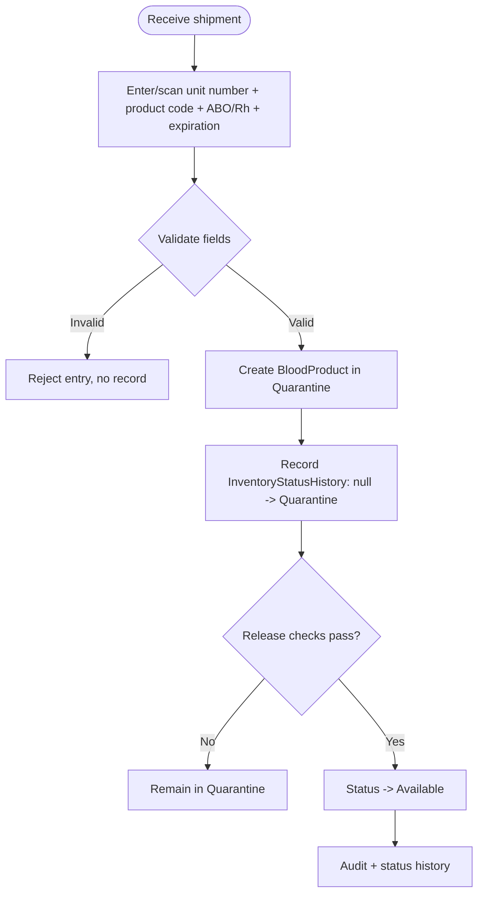
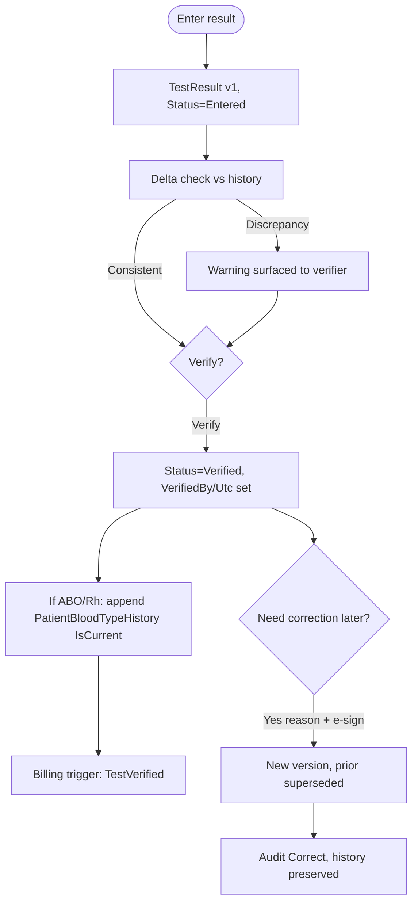
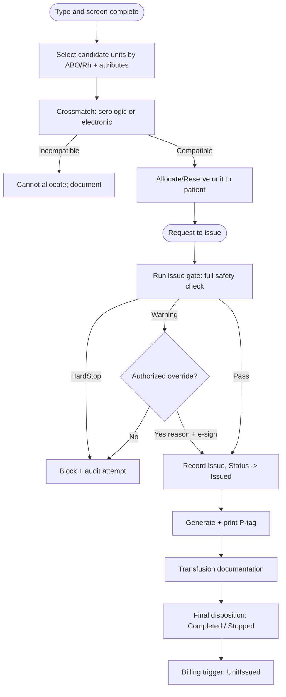
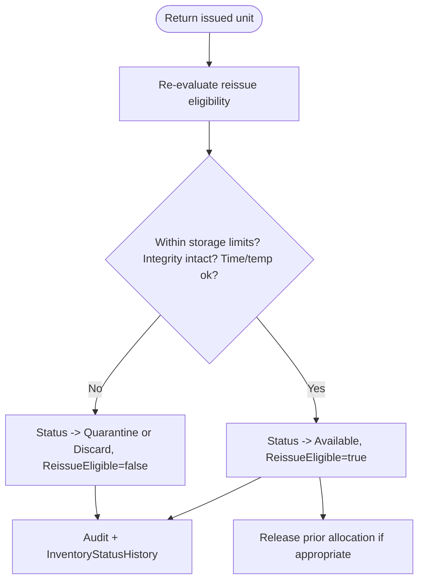
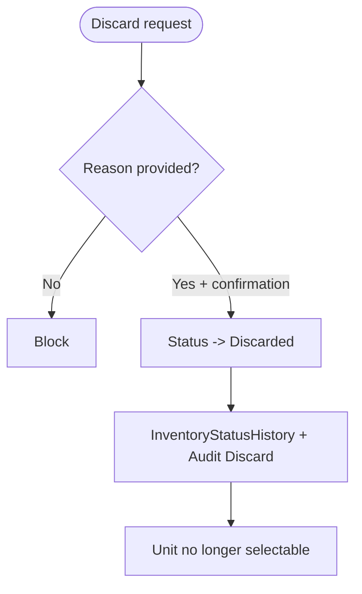
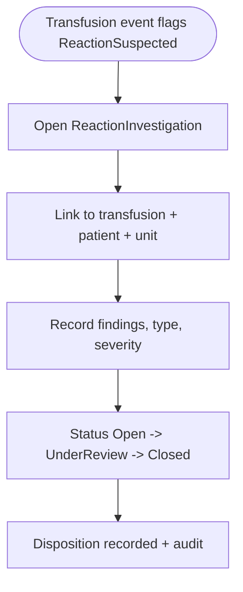
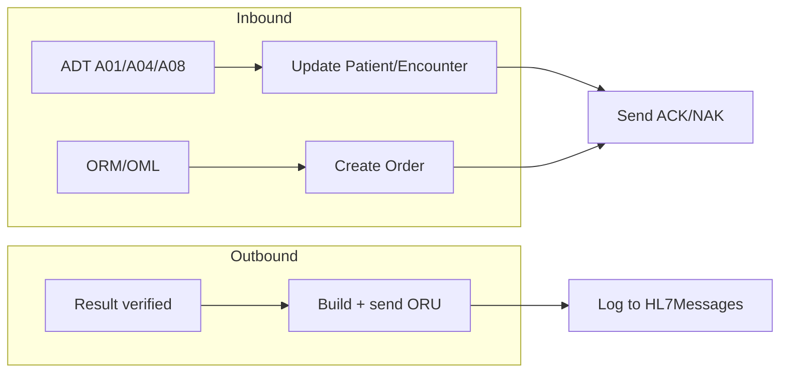

# Blood Bank LIS — Key Workflows

Status: Phase 0 (design). Each workflow names the use case(s), the safety checks invoked (see `safety-rules.md`), the state changes, and the audit events produced. Every clinical state change writes to its append-only history table and an `AuditEvent` in the same transaction.

Status legend for blood units: `Quarantine -> Available -> Allocated -> Issued -> Transfused`, with side states `Returned`, `Discarded`, `Expired`.

---

## 1. Unit intake (receiving)



- Use case: `ReceiveUnitCommand`, `ReleaseUnitFromQuarantineCommand`.
- Checks: unit number unique; expiration in the future; product type known; ABO/Rh present.
- Audit: `Create` (unit), `Update` (status change) with location.

---

## 2. Specimen accessioning and order linkage


- Use cases: `CreateOrderCommand`, `AccessionSpecimenCommand`, `LinkOrderSpecimenCommand`, `RejectSpecimenCommand`.
- Checks: patient identity resolved; collection date/time present and not in the future; specimen type valid.
- Expiration: computed from policy (e.g. type-and-screen specimen valid 3 days when patient may have been transfused/pregnant; configurable in `SystemConfiguration`). See `safety-rules.md`.

---

## 3. Result entry, verification, correction



- Use cases: `EnterResultCommand`, `VerifyResultCommand`, `CorrectResultCommand`.
- Checks: result cannot be verified by entry of unknown test; ABO/Rh discrepancy vs history (`RES-ABORH-DELTA`) blocks verify until an authorized override chooses Retain or Replace (gated by exception `MinSecurityLevel`); correcting a verified result requires reason + e-signature.
- No silent change: corrections always create a new `TestResults` version; the old row is retained and marked superseded.

---

## 4. Crossmatch, allocation, issue, transfusion (primary path)



- Use cases: `RecordCrossmatchCommand`, `AllocateUnitCommand`, `IssueUnitCommand`, `DocumentTransfusionCommand`.
- The **issue gate** (`safety-rules.md` section 1) runs the full check set before any unit leaves inventory.
- Electronic crossmatch path is allowed only when its preconditions are met (current ABO/Rh confirmed, negative antibody screen current/historical, no antibody history); otherwise serologic crossmatch is required (HardStop). Positive antibody screen (current or historical) or antibody history requires a complex crossmatch unless an authorized `ALLOC-XM-AB-HISTORY` override is recorded.
- Compatibility evaluation order: (1) ABO/Rh antigen/antibody conflict, (2) non-ABORH antigen-negative for RBC/WB (`ISS-ANTIGEN-NEG` Warning, supervisor+ override), (3) complex XM when indicated, (4) compatible XM required for RBC/WB.

---

## 5. Issue-to-patient gate (detail)


---

## 6. Emergency release (uncrossmatched)


- Crossmatch-not-performed becomes an overridable Warning only inside the emergency-release workflow; outside it, missing crossmatch on a crossmatch-required product is a HardStop.
- Records `Overrides` + `ElectronicSignatures`; flags the unit/patient for retrospective compatibility testing.

---

## 7. Return to inventory



- Use case: `ReturnUnitCommand`. Stores the per-check evaluation JSON so reissue decisions are auditable.

---

## 8. Discard



- Dangerous action: requires reason, confirmation, audit. Discarded units are excluded from all selection queries.

---

## 8a. Product modification (divide / pool / irradiate / thaw / volume-reduce / leukoreduce)

```mermaid
flowchart TD
    admin["Admin: ModificationRules + ExpirationModificationCodes\n(source, type, target, expiration code)"] --> eligible
    tech["Technologist selects source unit(s)"] --> eligible["GET eligible-modifications\n(active rules matching unit's product)"]
    eligible --> guard["UnitModificationEligibilityRule:\nstatus=Available, unexpired, product match;\nPool: >=2 sources + same product/ABO/Rh;\nDivide: >=2 result units, volumes <= source"]
    guard -->|HardStop| blocked[422 blocked, hardStops/warnings]
    guard -->|Pass| execute[Compute ResultExpiresUtc via\nModificationExpirationRule, capped at\nearliest source ExpiresUtc]
    execute --> source[Source unit(s) -> Modified\n+ InventoryStatusHistory]
    execute --> result[Result unit(s) created -> Quarantine\n+ DerivedFromModificationId]
    execute --> header[UnitModification header +\nUnitModificationUnit link rows]
    execute --> audit[Audit: Modify]
```

- Use cases: `DivideAsync`, `PoolAsync`, `ApplySingleAsync` (`BloodProductModificationService`).
- Every modification retires its source unit(s) into the terminal `Modified` status and creates new result unit(s) in `Quarantine` (new units always need release, same convention as intake) — this keeps 1→N (Divide), N→1 (Pool), and 1→1 (Irradiate/Thaw/Volume Reduction/Leukoreduction) on one execution path.
- Checks: source unit(s) `Available`, unexpired, and on the modification rule's source product; Pool additionally requires ≥2 sources with identical product/ABO/Rh (`MOD-POOL-ABO-MISMATCH` otherwise); Divide requires ≥2 result units and (if volumes are supplied) their sum must not exceed the source's volume.
- Expiration: `ResultExpiresUtc = min(anchor + offset, earliest source ExpiresUtc)` — the expiration modification code supplies the offset and whether the anchor is the modification date/time or the earliest source collection date/time. A result can never outlive its source(s), including the shortest-lived component pooled in. Collection-relative codes hard-stop (`MOD-COLLECTION-REQUIRED`) when a source has no collection timestamp.
- Dangerous action: requires a reason; records `AuditEventType.Modify` in addition to the automatic Create/Update audit on every touched/created row. Gated by `inventory.modify`; the rules table itself is gated by `admin.modification-rules.manage`.

---

## 9. Reaction investigation



---

## 10. HL7 message flows



- Inbound messages are persisted to `HL7Messages` first, then parsed, then mapped to Application commands (which run the same safety checks as the API). Failures go to `InterfaceErrorQueue` and produce a NAK.
- Detailed mapping, ACK/NAK, retry, and replay are specified in `hl7-design.md`.

---

## 11. Audit and signature touchpoints (summary)

| Workflow | Audit event(s) | E-signature required |
|---|---|---|
| Unit intake/release | Create, Update(status) | No |
| Accessioning/reject | Create, Update(status) | No |
| Result verify | Verify | Per policy |
| Result correction | Correct | Yes |
| Allocation | Update(status) | No |
| Issue (standard) | Issue | No (unless override) |
| Issue (emergency release) | Issue, Override | Yes |
| Warning override | Override | Yes |
| Return | Return, Update(status) | No |
| Discard | Discard, Update(status) | Confirmation + reason |
| Product modification | Modify, Create/Update(status) | Reason |
| ABO/Rh manual edit | Update(blood type history) | Yes |
| P-tag reprint | Reprint | Reason |
