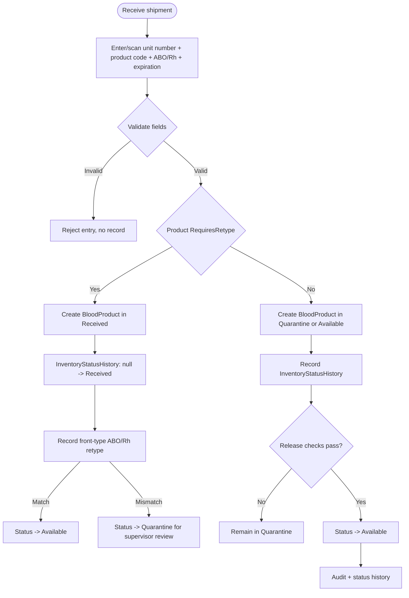
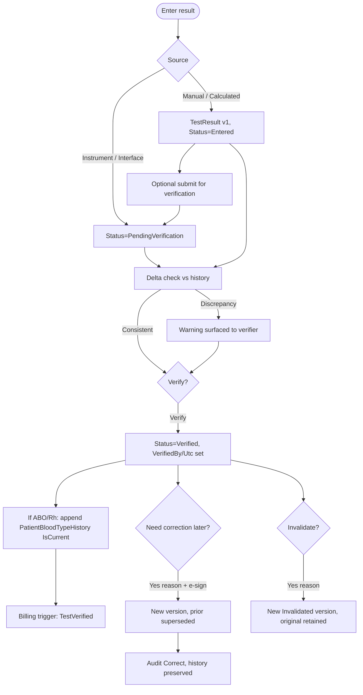
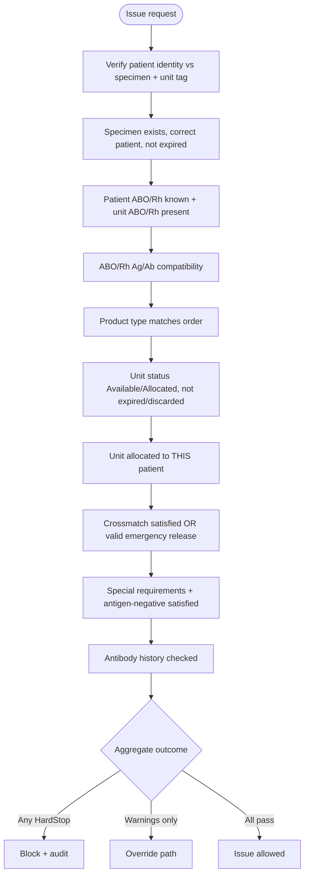
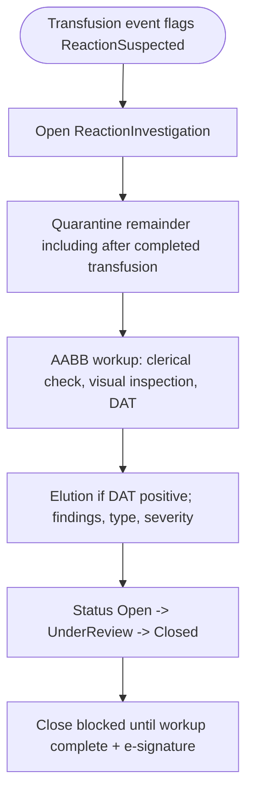
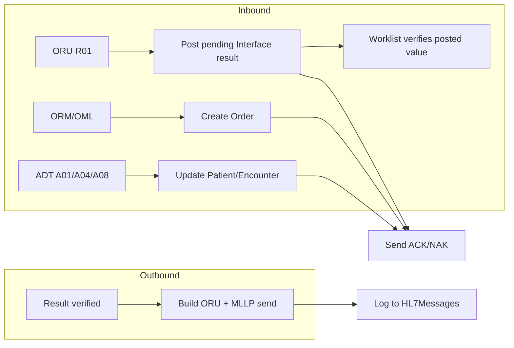

# Blood Bank LIS — Key Workflows

Status: Living workflow notes (not a Phase 0 draft). Each workflow names the use case(s), the safety checks invoked (see `safety-rules.md`), the state changes, and the audit events produced. Every clinical state change writes to its append-only history table and an `AuditEvent` in the same transaction.

Status legend for blood units: `Expected -> Received (retype required) or Quarantine -> Available -> Allocated -> Issued -> Transfused`, with side states `OnHold` (operational), `Missing` (inventory discrepancy), `Damaged` (container integrity), `Returned` (ward), `ReturnedToSupplier` (consignee/vendor), `Discarded`, `Expired`.

---

## 1. Unit intake (receiving)



- Use case: `ExpectUnitAsync` (packing-list / ASN), `ReceiveExpectedUnitAsync`, `CancelExpectedUnitAsync`, `ReceiveUnitCommand` (walk-in), `ReleaseUnitFromQuarantineCommand`, `RecordProductRetype`. Walk-in receive, expected-arrival confirmation, normalized-component intake, ISBT scan-session start/add/complete, and manual entry require `inventory.receive` (`INV-RCV-PERM` / `INV-SCAN-START-PERM` / `INV-SCAN-ADD-PERM`) in the Application service. Saving a unit antigen or antibody attribute (`POST /api/inventory/units/{id}/blood-attributes`) requires the same privilege (`INV-ATTR-PERM`).
- Expected inbound (SoftBank/SafeTrace consignee receipt): `POST /api/inventory/units/expected` creates `Expected` without visual inspection and sets `ExpectedArrivalDueUtc` from `Inventory.ExpectedArrivalDueHours` (default 24). Application requires `inventory.receive` (`INV-EXPECT-PERM`). The expected worklist (`GET /api/inventory/units/expected`) flags overdue packing lists (`INV-EXPECT-OVERDUE`) and includes product type. Confirm arrival (`receive-expected`) is available inline on `/inventory` Expected inbound (appearance, cooler temperature, second verifier) as well as in the unit Manage drawer. It applies `INV-RCV-VISUAL` / `INV-RCV-TEMP` / `INV-RCV-2ND` and lands in `Received` (retype) or `Quarantine`; late arrival is still allowed and is audited as late. Cancel moves to `CancelledAssignment` and requires `inventory.receive` (`INV-EXPECT-CXL-PERM`). Walk-in receive remains available for units that arrive without a prior packing list.
- Products with Retype Y start in `Received`. ISBT "Release to Available" is ignored until a matching retype is recorded.
- Front-type retype: Anti-A and Anti-B always; Anti-D required only when the unit is labeled Rh negative.
- Recording a retype requires `result.enter` (`RES-ENTER-PERM`) and is the second confirmation of the supplier type. Matching record: `Received -> Available`. Mismatch: `Received -> Quarantine` with the discrepancy as the reason (supervisor uses existing release). No second reviewer. A leftover Entered retype may still be confirmed at `POST /api/inventory/units/{id}/retype/{resultId}/verify` with `result.verify`. The pending retype board (`GET /api/inventory/retypes/pending`) is on `/inventory` with inline Enter (same `ProductRetypeEntryPanel` as `/test-worklist` Retype and the Manage drawer). Demo seed `W000123RET0001` / `W000123RET0002` is that worklist.
- Checks: unit number unique; expiration in the future; product type known; ABO/Rh present; coded appearance Acceptable (`INV-RCV-APPEAR` / `INV-RCV-VISUAL`; policy `Inventory.RequireReceiveVisualInspection`, default true); shipping-container temperature in 1–10 °C (`INV-RCV-TEMP`; policy `Inventory.RequireReceiveTemperature`, default true); autologous/directed recipient designated (`INV-AUTO-DIR`); distinct directory second verifier (`INV-RCV-2ND`; policy `Inventory.RequireReceiveVerifier`, default true). Defects (clots, hemolysis, leaking, …) and out-of-range temperatures are not received — return the unit to the supplier. Expect-unit (packing list) does not require visual, temperature, or a second verifier until arrival is confirmed; autologous/directed still require the intended recipient on the packing list.
- Quarantine release (`INV-Q-RELEASE-2ND`) requires a distinct active directory user as second verifier (SoftBank/SafeTrace quality release). Policy: `Inventory.RequireQuarantineReleaseVerifier` (default true). Application also requires `inventory.release` (`INV-REL-PERM`).
- Operational hold (`POST /api/inventory/units/{id}/hold`) is administrative, not quality quarantine. Application hold requires `inventory.release` (`INV-HOLD-SET-PERM`). Release from hold (`/release-hold`) requires `inventory.release` (`INV-HOLD-PERM`) and returns the unit to Available.
- Discard (`INV-DISC-2ND`) requires a distinct active directory user as second verifier (SoftBank/SafeTrace dual control to destroy a unit). Policy: `Inventory.RequireDiscardVerifier` (default true). Application also requires `inventory.discard` (`INV-DISC-PERM`).
- Location transfer (`POST /api/inventory/units/{id}/transfer`) requires `inventory.transfer` (`INV-XFER-PERM`) in the Application service.
- Missing (`POST /api/inventory/units/{id}/missing`) records a physical-inventory discrepancy. Application mark-missing requires `inventory.release` (`INV-MISS-PERM`). Locate (`/locate`) returns the unit to `Quarantine` for inspection — not directly to Available (AABB 21 CFR 606.165). Application locate requires `inventory.release` (`INV-LOC-PERM`).
- Damaged (`POST /api/inventory/units/{id}/damaged`) records container damage found in storage or handling (distinct from receive-time appearance reject). Application mark-damaged requires `inventory.release` (`INV-DMG-PERM`). Inspect (`/inspect-damaged`) moves the unit to `Quarantine`; discard remains available. Application inspect requires `inventory.release` (`INV-INSP-PERM`).
- Return to supplier (`POST /api/inventory/units/{id}/return-to-supplier`) closes failed consignee receipt or unused stock without destroying the unit. Distinct from cancel-expected (never arrived) and from ward `Returned`. Terminal; not issuable. Application requires `inventory.receive` (`INV-RTS-PERM`).
- Directed-to-allogeneic conversion (`POST /api/inventory/units/{id}/convert-directed`) releases an unused directed unit into volunteer inventory after `inventory.release`, a reason, and a distinct second verifier (`INV-DIR-PERM` / `INV-DIR-ALLO` / `INV-DIR-CONV-2ND`; policy `Inventory.RequireDirectedConversionVerifier`, default true). Autologous units cannot convert. Allocated/assigned/crossmatched/selected units must be released first. Clears `ReservedPatientId` and records the conversion on the unit. The named audit is `ProductStatus` (old/new restriction, reserved patient, reason, second verifier).
- Near-expiry worklist (`GET /api/inventory/units/near-expiry`) lists on-hand units that expire within `Inventory.NearExpiryWarningHours` (default 24). SoftBank/SafeTrace FIFO outdate list. The issue gate still warns `UNIT-NEAR-EXPIRY`. The expiration sweep (`POST /api/inventory/expire-due`) moves due units to Expired and requires `inventory.discard` in the Application service (`INV-EXP-PERM`).
- Quality-quarantine worklist (`GET /api/inventory/units/quarantine`) lists units in `Quarantine` with a coded reason (`BloodUnit.QuarantineReasonCode`, `INV-Q-REASON`), product code, and the latest retype interpretation when a mismatch exists. `/inventory` Releases from the row with the same second-verifier gate as Manage. Place in quarantine (`POST /api/inventory/units/{id}/quarantine`) requires a catalog code; Other needs notes. Application quarantine requires `inventory.release` (`INV-Q-PERM`). Intake, locate, inspect, retype, failed return, reaction remainder, and modifications set the matching code.
- Inventory discrepancy worklist (`GET /api/inventory/units/discrepancy`) lists `Missing` and `Damaged` units with product and ABO/Rh awaiting locate or inspect (SoftBank/SafeTrace physical inventory; 21 CFR 606.165). `/inventory` Locates or Inspects from the row with the same `inventory.release` gates as Manage.
- Operational-hold worklist (`GET /api/inventory/units/on-hold`) lists `OnHold` units with product, ABO/Rh, and hold reason. `/inventory` Releases from the row through existing `ReleaseFromHoldAsync` (`INV-HOLD-PERM`). It is not a quality-quarantine board.
- Audit: `Create` (unit), `Update` (status change) with location.

---

## 2. Specimen accessioning and order linkage


- Use cases: `CreateOrderCommand`, `AccessionSpecimenCommand`, `LinkOrderSpecimenCommand`, `RejectSpecimenCommand`. Creating, updating, or cancelling an order, or linking a specimen from the workspace, requires `patient.write` (`ORD-CREATE-PERM` / `ORD-UPD-PERM` / `ORD-CXL-PERM` / `ORD-LINK-PERM`) in `OrderService`. Inbound ORM create uses `CreateFromHl7Async` and stays ungated. Allocation-created crossmatch orders use `CreateForAllocationAsync`. Creating or updating a visit from the workspace requires `patient.write` (`ENC-CREATE-PERM` / `ENC-UPD-PERM`) in `EncounterService`. Inbound ADT visit upsert remains ungated.
- Checks: patient identity resolved; collection date/time present and not in the future; specimen type valid.
- Accession requires `specimen.accession` (`SPEC-ACC-PERM`). Editing collection metadata requires `specimen.edit` (`SPEC-EDIT-PERM`). Rejecting a specimen requires `specimen.reject` (`SPEC-REJ-PERM`) in the Application service.
- Expiration: computed from policy (e.g. type-and-screen specimen valid 3 days when patient may have been transfused/pregnant; configurable in `SystemConfiguration`). See `safety-rules.md`.

---

## 3. Result entry, verification, correction



- Use cases: `EnterResultCommand`, `SubmitForVerificationCommand`, `VerifyResultCommand`, `CorrectResultCommand`, `InvalidateResultCommand`.
- The pending test worklist (`GET /api/test-worklist/pending`, `/test-worklist`) and the patient Tests tab show current ABO/Rh, antibody history (including currently undetectable), specimen expiration, electronic-XM eligibility, an open antibody-identification workup, a `RES-ABORH-DELTA` discrepancy badge when an entered type disagrees with history, and the posted result value. Interface or instrument `PendingVerification` rows use Verify instead of Enter. The ABO enterer is not offered Verify posted result. Entry is still blocked when the specimen is missing, not Accepted, or expired. The Patient Orders tab shows HL7 source and the posted interface value and Verifies the same result without re-keying. The Patient link opens `/patients/{id}?tab=tests`. ABID opens `/patients/{id}/antibody-id/{workupId}`. The standalone `/compatibility` page identifies the recipient by MRN/name search and the specimen by accession, not by internal numeric ids.
- Patient ABO/Rh stay `Entered` after save/complete. A second user verifies (`RES-SELF-VERIFY` when `Result.BlockAboSelfVerify` is on, default). Current type is written only on verify. The entering user cannot verify their own ABO/Rh.
- Checks: result cannot be verified by entry of unknown test; ABO/Rh discrepancy vs history (`RES-ABORH-DELTA`) blocks verify until an authorized override chooses Retain or Replace (gated by exception `MinSecurityLevel`); correcting a verified result requires reason + e-signature.
- No silent change: corrections always create a new `TestResults` version; the old row is retained and marked superseded.

---

## 4. Crossmatch, allocation, issue, transfusion (primary path)


- Use cases: `RecordCrossmatchCommand`, `AllocateUnitCommand`, `IssueUnitCommand`, `DocumentTransfusionCommand`. Allocation requires `compatibility.allocate` (`XM-ALLOC-PERM`) and recording a crossmatch requires `compatibility.crossmatch` (`XM-PERM`) in the Application service. Releasing a reservation requires `compatibility.allocate` (`XM-REL-PERM`). Issue requires `issue.create` (`ISS-CREATE-PERM`) before the issue gate. After reserve, `/issuing` Ready to issue (`GET /api/issues/ready-to-issue`) lists reserved units by MRN and unit number; Issue on the row prefills the existing issue form. `/compatibility` links to `/issuing?patientId=&bloodUnitId=` after a successful reserve. Documenting a transfusion requires `transfusion.document` (`TXN-DOC-PERM`) in the Application service. Ward receipt requires the same privilege (`TXN-WARD-PERM`). Direct `InterfaceTransfusionService.DocumentAsync` requires the same privilege (`TXN-IFACE-PERM`); inbound BPAM uses `DocumentFromHl7Async` and stays ungated. A processed RAS for an issued unit appears on patient product history with source `HL7-BPAM` so staff do not re-document it on `/issuing`. Demo seed `MRN0009` / `W000123BPAM001` is that load. Printing a specimen, compatibility, or component label requires `print.label` (`PRT-LABEL-PERM`) in `PrintService`. Reprinting a stored job requires a reason and `print.reprint` (`PRT-REPRINT-PERM`).
- The **issue gate** (`safety-rules.md` section 1) runs the full check set before any unit leaves inventory.
- Electronic crossmatch path is allowed only when its preconditions are met (current ABO/Rh confirmed, negative antibody screen current/historical, no antibody history, no open antibody-identification workup, including one linked to a received-not-accepted or collected-not-received specimen, plus configurable minimum negative-screen visits/specimens/tests); otherwise serologic crossmatch is required (HardStop, including `XM-EC-ABID-OPEN`, `XM-EC-VISITS`, `XM-EC-SPECIMENS`, `XM-EC-TESTS`). Admin Crossmatch Settings define the default XM/CXM tests and those minimums. Serologic XM/CXM attach to the product order after the current antibody screen is verified; EXM-eligible patients skip that attach. Changing a complex XM line to a simple XM requires an append-only `ALLOC-XM-AB-HISTORY` override on the order. Selecting a unit for an EXM-eligible patient with a current type and screen auto-adds and results EXM on the product order (no second XM order). Allocating while a workup is open warns (`ABID-ALLOC-OPEN`) and still reserves. Serologic XM warns (`ABID-XM-OPEN`) and still records. Issue warns (`ABID-ISSUE-OPEN`) after the gate and still issues without an extra override. Completing while reserved or issued units remain warns (`ABID-COMPLETE-PRODUCTS`) and requires acknowledgment; it does not identify antibodies or release those units. Voiding while reserved or issued units remain warns (`ABID-VOID-PRODUCTS`) and still voids. Positive antibody screen (current or historical) or antibody history requires a complex crossmatch unless an authorized `ALLOC-XM-AB-HISTORY` override is recorded.
- Compatibility evaluation order: (1) ABO/Rh antigen/antibody conflict, (2) non-ABORH antigen-negative for RBC/WB (`ISS-ANTIGEN-NEG` Warning, supervisor+ override), (3) complex XM when indicated, (4) compatible XM required for RBC/WB.

---

## 5. Issue-to-patient gate (detail)



- After a successful issue the unit is **in transit** until ward receipt or return. Optional `CoolerId` records SoftBank-style cooler checkout. `InTransitDueUtc` is `IssuedUtc` plus `Issue.InTransitDueHours` (default 4). The issuing worklist (`GET /api/issues/in-transit`) flags overdue custody (`ISS-IN-TRANSIT`) and shows unit number, current ABO/Rh, antibody history, and specimen expiration rather than a raw unit id. Receive on that row prefills ward receipt. Issued units remain on `GET /api/issues/outstanding` after ward receipt so `/issuing` can Return or Document by unit number. Late ward receipt is still allowed and is audited as `Transfusion` (late). ISBT-labeled units require a fresh quadrant scan at ward receipt (`UnitScanMismatch`), matching the SoftBank remote-issue chain (issue scan → cooler → ward scan → bedside scan). Legacy units without `ComponentIdentity` are not blocked. HL7 BPAM administration stamps implicit receipt without a scan because the interface already identified the unit.
- Generic issue on `/issuing` identifies the recipient by MRN and name. Selecting the patient fills the MRN and date-of-birth identity tokens; issue stays disabled until a patient is selected. The issue gate still verifies those tokens.
- Documenting a transfusion requires two independent patient identity tokens that match the issued patient (`ISS-IDENTITY`). A checkbox is not positive identification. Electronic dual-ID (`TX-DUAL-ID`) is complete only when those tokens match and an ISBT bedside unit scan verifies. Legacy units keep the prior scan policy. Second-verifier policy is unchanged (OCD-008).
- Appearance at issue uses the same coded catalog as receive (`ISS-APPEAR`). Defects are a HardStop; the selected code is stored on `Issues.IssueAppearance`.
- Appearance at ward receipt uses the same catalog (`TX-WARD-APPEAR`). Defects are a HardStop — return the unit to the blood bank. The selected code is stored on `Issues.WardAppearance`.

---

## 6. Emergency release (uncrossmatched)


- Crossmatch-not-performed becomes an overridable Warning only inside the emergency-release workflow; outside it, missing crossmatch on a crossmatch-required product is a HardStop.
- Records `Overrides` + `ElectronicSignatures`; flags the unit/patient for retrospective compatibility testing (`TestsIncompleteAtIssue`, due date from `Issue.RetrospectiveCrossmatchDueHours`). The Issuing page lists pending follow-up with specimen accession until a post-issue compatible crossmatch is recorded. Record crossmatch on that row opens `/compatibility` with patient, issued unit, and specimen already selected.

---

## 7. Return to inventory


- Use case: `ReturnUnitCommand`. Stores the per-check evaluation JSON so reissue decisions are auditable. Returning an issued unit requires `issue.return` (`ISS-RET-PERM`) in the Application service.

---

## 8. Discard


- Dangerous action: requires reason, confirmation, audit. Discarded units are excluded from all selection queries. Discarding a unit requires `inventory.discard` (`INV-DISC-PERM`) in the Application service.

---

## 8a. Product modification (divide / pool / irradiate / thaw / volume-reduce / leukoreduce)

```mermaid
flowchart TD
    admin["Admin: ModificationRules + ExpirationModificationCodes\n(code, source product, type, target product, expiration code)"] --> eligible
    tech["Technologist selects source unit(s)"] --> eligible["GET eligible-modifications\n(active rules matching unit's product)"]
    eligible --> guard["UnitModificationEligibilityRule:\nstatus=Available, unexpired, product match;\nPool: >=2 sources + same product/ABO/Rh;\nDivide: >=2 result units, required volumes <= source"]
    guard -->|HardStop| blocked[422 blocked, hardStops/warnings]
    guard -->|Pass| execute[Compute ResultExpiresUtc via\nModificationExpirationRule, capped at\nearliest source ExpiresUtc]
    execute --> source[Source unit(s) -> Modified\n+ InventoryStatusHistory]
    execute --> result[Result unit(s) created -> Quarantine\n+ DerivedFromModificationId]
    execute --> header[UnitModification header +\nUnitModificationUnit link rows]
    execute --> audit[Audit: Modify]
```

- Use cases: `DivideAsync`, `PoolAsync`, `ApplySingleAsync` (`BloodProductModificationService`).
- Every modification retires its source unit(s) into the terminal `Modified` status and creates new result unit(s) in `Quarantine` (new units always need release, same convention as intake) — this keeps 1→N (Divide), N→1 (Pool), and 1→1 (Irradiate/Thaw/Volume Reduction/Leukoreduction) on one execution path.
- Checks: source unit(s) `Available`, unexpired, and on the modification rule's source product; Pool additionally requires ≥2 sources with identical product/ABO/Rh (`MOD-POOL-ABO-MISMATCH` otherwise); Divide requires ≥2 result units, a volume on every child (`MOD-DIVIDE-VOLUME-REQUIRED`), and a child-volume sum that does not exceed the source (`MOD-VOLUME-EXCEEDS-SOURCE`).
- Divide product codes are generated by the application using ISBT 128 alphabetic division: `V00` → `V0A` / `V0B` (then `V0C`…); subdividing `V0A` yields `VAa` / `VAb`. The 8-character `ProductCodeData` does not need its own `ProductTypes` row when the 5-character PDC matches the catalog. If the modification rule's target product uses a different PDC, that target code is used and then the new division is applied. Second-level codes cannot be divided further (`MOD-DIVIDE-LEVEL-EXCEEDED`). Child volumes are stored on each result unit.
- Expiration: `ResultExpiresUtc = min(anchor + offset, earliest source ExpiresUtc)` — the expiration modification code supplies the offset and whether the anchor is the modification date/time or the earliest source collection date/time. A result can never outlive its source(s), including the shortest-lived component pooled in. Collection-relative codes hard-stop (`MOD-COLLECTION-REQUIRED`) when a source has no collection timestamp.
- Dangerous action: requires a reason; records `AuditEventType.Modify` in addition to the automatic Create/Update audit on every touched/created row. Application requires `inventory.modify` (`INV-MOD-PERM`). The rules table itself is gated by `admin.modification-rules.manage`.

---

## 9. Reaction investigation



- Opening from a suspected transfusion is an automatic issue-path write. Updating the investigation, recording CBER notification, or recording the written fatality report requires `reaction.investigate` (`RXN-PERM`) in the Application service.
- The reaction board (`GET /api/reaction-investigations`) shows patient name, MRN, unit number, patient and labeled unit ABO/Rh, an advisory `AboCompatibilityRule` badge when those labeled types conflict, an advisory `ReactionRepeatAboRhRule` badge when a recorded repeat disagrees with the current or labeled type, issue type / crossmatch status, antibody history, the first `ReactionWorkupCompletenessRule` hold, and remainder-hold status rather than raw ids. The badges do not change the close gate. Repeat fields stay empty until recorded. `/reactions?id=` and `?patientId=` open the matching case. Documenting a suspected transfusion on `/issuing` links to that workup. Patient product history Reaction opens the same board filtered by patient. Remainder quarantine applies from Issued, started, stopped, Transfused, or Returned and does not mark held if the move fails.

Creating or closing a quality-system deviation requires `deviation.manage` (`DEV-PERM`) in the Application service.

DIN lookback recall requires `lookback.manage` (`LK-RECALL-PERM`) in the Application service. Recording a recipient-notification attempt (`RecordAttemptAsync`) requires the same privilege (`LK-ATTEMPT-PERM`). Find-by-DIN and recipient traceback remain ungated in the service; the HTTP group still requires `lookback.manage`.

---

## 10. HL7 message flows



- Inbound messages are persisted to `HL7Messages` first, then parsed, then mapped to Application commands (which run the same safety checks as the API). Failures go to `InterfaceErrorQueue` and produce a NAK. The error-queue and message-log worklists show PID MRN and name with control id and message type, plus placer / test / unit when those fields are present. Inbound rows Replay; outbound rows Send. An accepted inbound replay or outbound AA resolves the original work item.
- Patient name, date of birth, and sex can also be edited on the patient record. Application requires `patient.write` (`PAT-WRITE-PERM`). Creating a patient requires the same privilege (`PAT-CREATE-PERM`). MRN stays immutable after create. A later ADT A08 may overwrite those demographic fields through the HL7 processor (not `PatientService`). ADT patient insert also bypasses `PatientService`.
- Manual merge of a duplicate into the surviving record requires `patient.merge` in `PatientMergeService.MergeAsync` (`PAT-MERGE-PERM`; Supervisor and Administrator by default). A reason is required. History and antibody-identification workups are reassigned, not deleted. Merge HardStops if both records have an open workup (`ABID-MERGE-DUP-OPEN`) and warns if one does (`ABID-MERGE-WORKUP`). ADT A18/A40 uses `MergeFromHl7Async` and stays ungated.
- Directory user create/update/role assignment requires `admin.users.manage` in `UserAdminService` (`USR-CREATE-PERM` / `USR-UPD-PERM` / `USR-ASSIGN-PERM`). Activate/deactivate, lock/unlock, and password-reset request use the same privilege (`USR-ACTIVE-PERM` / `USR-LOCK-PERM` / `USR-RESET-PERM`). Role create/update requires `admin.roles.manage` (`ROLE-CREATE-PERM` / `ROLE-UPD-PERM`).
- Creating, updating, activating, deactivating, or cloning a test definition requires `admin.tests.manage` in `TestDefinitionAdminService` (`TEST-CREATE-PERM` / `TEST-UPD-PERM` / `TEST-ACT-PERM` / `TEST-DEACT-PERM` / `TEST-CLONE-PERM`).
- Creating or updating a blood-attribute definition requires `admin.config.edit` in `BloodAttributeAdminService` (`ATTR-CREATE-PERM` / `ATTR-UPD-PERM`). Activate/deactivate requires `admin.config.activate` (`ATTR-ACT-PERM` / `ATTR-DEACT-PERM`).
- Creating or updating a reflex rule requires `admin.tests.manage` in `ReflexRuleAdminService` (`REFLEX-CREATE-PERM` / `REFLEX-UPD-PERM`). Activate/deactivate requires `admin.config.activate` (`REFLEX-ACT-PERM` / `REFLEX-DEACT-PERM`).
- Creating or updating a subtest definition requires `admin.tests.manage` in `SubtestDefinitionAdminService` (`SUBTEST-CREATE-PERM` / `SUBTEST-UPD-PERM`). Activate/deactivate requires `admin.config.activate` (`SUBTEST-ACT-PERM` / `SUBTEST-DEACT-PERM`).
- Creating or updating a test grouper requires `admin.tests.manage` in `TestGrouperAdminService` (`GROUPER-CREATE-PERM` / `GROUPER-UPD-PERM`). Activate/deactivate requires `admin.config.activate` (`GROUPER-ACT-PERM` / `GROUPER-DEACT-PERM`).
- Creating or updating an order or test rule requires `admin.tests.manage` in `RuleDefinitionAdminService` (`RULEDEF-CREATE-PERM` / `RULEDEF-UPD-PERM`). Activate/deactivate requires `admin.config.activate` (`RULEDEF-ACT-PERM` / `RULEDEF-DEACT-PERM`).
- Creating or updating a phase definition requires `admin.tests.manage` in `PhaseDefinitionAdminService` (`PHASE-CREATE-PERM` / `PHASE-UPD-PERM`). Activate/deactivate requires `admin.config.activate` (`PHASE-ACT-PERM` / `PHASE-DEACT-PERM`).
- Creating or updating an exception definition requires `admin.config.edit` in `ExceptionDefinitionAdminService` (`EXC-CREATE-PERM` / `EXC-UPD-PERM`). Activate/deactivate requires `admin.config.activate` (`EXC-ACT-PERM` / `EXC-DEACT-PERM`).
- Creating or updating a specimen-type definition requires `admin.config.edit` in `SpecimenTypeAdminService` (`SPECTYPE-CREATE-PERM` / `SPECTYPE-UPD-PERM`). Activate/deactivate requires `admin.config.activate` (`SPECTYPE-ACT-PERM` / `SPECTYPE-DEACT-PERM`).
- Creating or updating a product definition requires `admin.products.manage` in `ProductAdminService` (`PROD-CREATE-PERM` / `PROD-UPD-PERM`). Activate/deactivate requires `admin.config.activate` (`PROD-ACT-PERM` / `PROD-DEACT-PERM`).
- Creating or updating a modification rule requires `admin.modification-rules.manage` in `ModificationRuleAdminService` (`MODRULE-CREATE-PERM` / `MODRULE-UPD-PERM`). Activate/deactivate requires `admin.config.activate` (`MODRULE-ACT-PERM` / `MODRULE-DEACT-PERM`).
- Creating or updating an expiration modification code requires `admin.modification-rules.manage` in `ExpirationModificationCodeAdminService` (`EXPCODE-CREATE-PERM` / `EXPCODE-UPD-PERM`). Activate/deactivate requires `admin.config.activate` (`EXPCODE-ACT-PERM` / `EXPCODE-DEACT-PERM`).
- Creating, updating, enabling, or disabling an HL7 endpoint requires `admin.hl7.manage` in `Hl7ConfigAdminService` (`HL7EP-CREATE-PERM` / `HL7EP-UPD-PERM` / `HL7EP-ENABLE-PERM` / `HL7EP-DISABLE-PERM`).
- Replacing HL7 value translations requires `admin.hl7.manage` in `InterfaceTranslationAdminService` (`HL7XLAT-REPLACE-PERM`).
- Creating or updating a charge code requires `admin.config.edit` in `ChargeCodeAdminService` (`CHG-CREATE-PERM` / `CHG-UPD-PERM`). Activate/deactivate requires `admin.config.activate` (`CHG-ACT-PERM` / `CHG-DEACT-PERM`).
- Creating or updating a charge rule requires `admin.config.edit` in `ChargeRuleAdminService` (`CHGRULE-CREATE-PERM` / `CHGRULE-UPD-PERM`). Activate/deactivate requires `admin.config.activate` (`CHGRULE-ACT-PERM` / `CHGRULE-DEACT-PERM`).
- Creating or updating a product billing row requires `admin.config.edit` in `ProductBillingAdminService` (`PRODBILL-CREATE-PERM` / `PRODBILL-UPD-PERM`). Activate/deactivate requires `admin.config.activate` (`PRODBILL-ACT-PERM` / `PRODBILL-DEACT-PERM`).
- Creating or updating a test/service billing row requires `admin.config.edit` in `TestServiceBillingAdminService` (`TSBILL-CREATE-PERM` / `TSBILL-UPD-PERM`). Activate/deactivate requires `admin.config.activate` (`TSBILL-ACT-PERM` / `TSBILL-DEACT-PERM`).
- Creating or updating an ordering provider requires `admin.config.edit` in `OrderingProviderAdminService` (`ORDPROV-CREATE-PERM` / `ORDPROV-UPD-PERM`). Activate/deactivate requires `admin.config.activate` (`ORDPROV-ACT-PERM` / `ORDPROV-DEACT-PERM`).
- Creating or updating an ordering location requires `admin.config.edit` in `OrderingLocationAdminService` (`ORDLOC-CREATE-PERM` / `ORDLOC-UPD-PERM`). Activate/deactivate requires `admin.config.activate` (`ORDLOC-ACT-PERM` / `ORDLOC-DEACT-PERM`).
- Reviewing a captured charge requires `billing.review` in `BillingService` (`BILL-REV-PERM`). Cancelling requires `billing.cancel` (`BILL-CXL-PERM`). Exporting requires `billing.export` (`BILL-EXP-PERM`). Capture stays ungated. A catalog match skips overlapping charge rules so verify, issue, and transfusion each create one event and one DFT. Demo seed deactivates ChargeRules that duplicate catalog keys. The review queue (`GET /api/billing/charges`, `/billing`) shows patient name, MRN, test code or unit number, and the queued DFT control id for Pending and Reviewed rows so export can follow review on the same list. Demo seed captures Patricia Demo verify/issue/transfusion charges and Helen Interface issue/transfusion charges so the queue is not empty after a fresh database. Completed inbound RAS uses the same capture path as Issuing Document.
- Creating or updating an inventory location requires `admin.config.edit` in `InventoryLocationAdminService` (`INVLOC-CREATE-PERM` / `INVLOC-UPD-PERM`). Activate/deactivate requires `admin.config.activate` (`INVLOC-ACT-PERM` / `INVLOC-DEACT-PERM`).
- Detailed mapping, ACK/NAK, retry, and replay are specified in `hl7-design.md`.

---

## 10a. Antibody identification (antigram)

- Open a workup on an in-date panel lot (`ABID-LOT-EXPIRED` / `ABID-LOT-INACTIVE`). Application requires `immuno.record` (`ABID-WORKUP-PERM`). Optional selected-cell lots may be attached. If an attached lot later expires, Accept and complete warn and require acknowledgment (OCD-027). A deactivated attached lot HardStops Accept and complete. Staff with `admin.config.edit` create manufacturers (`ABID-MFG-CREATE-*`) and lots (cells and typed antigens required; `ABID-LOT-CREATE-*`) at `/admin/antibody-panel-lots`. Create writes `TestChange`. Staff with `admin.config.view` can open a lot's cell/antigen map (`GET /api/admin/antibody-panel-lots/{id}`) and see open workups that still use the lot. Viewing does not identify antibodies. Staff with `admin.config.activate` withdraw or restore manufacturers and lots (reason required to deactivate). Manufacturer and lot lists show how many open workups, completed workups, and completed workups that posted history used that reagent source. Viewing a manufacturer or lot lists those workups (patient, MRN, lot). Manufacturer rows list every attached lot from that manufacturer, including selected-cell lots. Completed rows show how many Identified findings posted to history (`PostedHistoryCount`) without naming specificities. Voided workups are omitted. Viewing does not identify antibodies. Lot admin can open `/antibody-id?lot=` to filter the open worklist. The worklist lot column and filter include attached selected-cell lots. Inactive and expired badges name the affected lot. Creating a manufacturer or lot does not identify antibodies. A deactivated manufacturer cannot be used for a new lot.
- Enter cell/phase reaction grades, DAT (when applicable), autocontrol, and comments.
- Run assistance. Findings are advisory (Excluded / Possible / CannotExclude / Historical). The engine never identifies antibodies. Saving reactions, attaching lots, recording DAT, or linking a specimen refreshes stored assistance to match the current antigram. Refresh is not an identification. Dosage `CannotExclude` warns `ABID-SEL-CELL`; attach an in-date selected-cell lot to the open workup, record those reactions, and run assistance again.
- Technologist records interpretation and may classify Identified / Possible / Excluded. Live assistance leftovers (`ABID-UNEXCLUDED`, `ABID-SEL-CELL`, history, incomplete panel) warn at interpret and do not identify antibodies. Assist rows cannot be Identified (`ABID-ASSIST-IDENTIFIED`). Catalog antibodies are preferred; free-text Identified specificities are resolved when unique (`ABID-INTERP-UNMATCHED` if not). Identifying a specificity when the patient is antigen-positive warns (`ABID-INTERP-PHENO` / `ABID-INTERP-GENO`) and still requires technologist judgment. Identifying a specificity that assistance would exclude on the current reactions warns (`ABID-INTERP-EXCLUDED`) and HardStops until a rationale is recorded (`ABID-INTERP-EXCL-REASON`). Assistance still does not identify antibodies. Changing reactions, attaching selected cells, recording DAT, linking/changing specimen, ABO/Rh, or antigen type after interpretation withdraws that interpretation and supervisor review; both must be repeated (`ABID-INTERP-STALE` / `ABID-REVIEW-STALE`). The open workup names that withdrawal (panel, specimen, ABO/Rh, or antigen-type) so staff do not re-interpret against the wrong fact.
- Supervisor review requires `immuno.override` (`ABID-REVIEW-PERM`). Default policy blocks the same user (`ABID-REVIEW-SELF`) and requires acceptance before complete (`ABID-REVIEW-REQUIRED`). Accept HardStops Identified sign-off on a blank panel, a rejected/cancelled specimen, a collected-not-received specimen, or an unverified ABO/Rh or antigen correction (`ABID-TYPE-PENDING`). Clinical completion warnings (including reserved or issued units, `ABID-COMPLETE-PRODUCTS`) require a supervisor acknowledgment (`ABID-REVIEW-ACK`) that does not identify antibodies.
- Complete posts only technologist-Identified specificities to `AntibodyHistory`. Completing with none identified warns `ABID-COMPLETE-NONE`. Clinical completion warnings (`ABID-COMPLETE-NONE`, `ABID-UNEXCLUDED`, `ABID-SEL-CELL`, `ABID-INTERP-EXCLUDED`, `ABID-HIST-REMAINS`, `ABID-HIST-UNDETECTED`, `ABID-DAT-INDICATED`, `ABID-COMPLETE-PRODUCTS`, incomplete-panel warning, phenotype/genotype conflict) HardStop until the technologist records an acknowledgment (`ABID-COMPLETE-ACK`). Acknowledgment does not identify antibodies. Autocontrol reactive without DAT warns `ABID-DAT-INDICATED`. Identified antibodies cannot post while a panel or selected cell has no interpretive-phase reaction (`ABID-INCOMPLETE-RXN`). Completing warns if assistance still cannot exclude other specificities (`ABID-UNEXCLUDED`) or still needs a homozygous selected cell (`ABID-SEL-CELL`). Those warnings do not identify the leftover antibodies. Existing antibody history remains visible on the workup and still drives antigen-negative selection (`ABID-HIST-REMAINS`). A current panel that would exclude a historical specificity warns `ABID-HIST-UNDETECTED` and does not remove history. Free-text ABID verify still exists when no workup is in scope; an open or completed workup is the identification of record (`ABID-WORKUP-OPEN` / `ABID-WORKUP-AUTHORITATIVE`, OCD-023). A blood-attribute antibody verify that would post or deactivate history HardStops while an in-scope workup is open (`ABID-WORKUP-OPEN`) and skips post or deactivate after a completed in-scope workup (`ABID-WORKUP-AUTHORITATIVE` / `ABID-WORKUP-DISAGREE`). Rejecting a linked specimen warns (`ABID-SPEC-OPEN`), withdraws interpretation, and keeps the open workup as the patient-wide identification of record until void or re-link. Patient-chart Add antibody or Deactivate HardStops while any open workup exists for that patient (`ABID-WORKUP-OPEN`). After complete or void, deactivate remains the authorized immuno path (OCD-017). Deactivating a specificity posted by a completed workup warns (`ABID-DEACT-POSTED`) and still deactivates. Changing a patient antigen while a workup is open — chart save or a verified antigen result — warns (`ABID-AG-OPEN`) and withdraws interpretation and review. Invalidating that verified antigen result warns (`ABID-AG-INVAL`) and withdraws again without reverting phenotype. Manually changing ABO/Rh, or verifying an ABO/Rh result that changes current type, while a workup is open warns (`ABID-ABO-OPEN`) and withdraws interpretation and review. Correcting a verified ABO/Rh or antigen result while a workup is open warns (`ABID-TYPE-CORR`) and does not withdraw; complete and Accept HardStop (`ABID-TYPE-PENDING`) until it is verified or invalidated. Changing antigen or ABO/Rh after a completed in-scope workup warns (`ABID-AG-DONE` / `ABID-ABO-DONE`) and does not reopen or retract posted history. An antigen-positive type that conflicts with posted Identified history also warns `ABID-AG-DONE`. Adding or deactivating a special requirement while a workup is open warns (`ABID-SR-OPEN`) and still records. Serologic XM warns (`ABID-XM-OPEN`) and still records while a workup is open.
- Void abandons an incomplete workup with a required reason. It does not post history and releases the free-text ABID path. Voiding while reserved or issued units remain warns (`ABID-VOID-PRODUCTS`) and still voids. Completed workups cannot be voided.
- UI: `/antibody-id` lists open workups (patient, MRN, accession or Unscoped, next bench action, inactive/expired lot badges). The dashboard card and Patient & Lab nav open the worklist. `/patients/{id}/antibody-id` is the patient workup list and antigram. The patient Antibodies card lists open workups (next action, unscoped or accession, named inactive/expired lots) and disables Add antibody and Deactivate while a workup is open, without identifying antibodies. Selected-cell pickers and the open workup lot line show manufacturer; inactive/expired alerts name the lot. Both lists flag a withdrawn or clock-expired attached lot (including selected cells) and show whether the next step is record reactions, interpret, or supervisor review. Completed and voided patient-list rows show Completed or Voided (`NextAction` is `None`), not Record reactions. Lists do not identify antibodies. `GET /api/antibody-id/summary` includes counts, `UnusableSpecimenCount`, `ExpiredSpecimenCount`, `UnacceptedSpecimenCount`, `NotReadySpecimenCount`, and distinct inactive/expired lot numbers (dashboard specimen badges open `/antibody-id?unusable=1` / `/antibody-id?expired=1` / `/antibody-id?unaccepted=1` / `/antibody-id?notready=1`; next-action counts open `/antibody-id?action=`; lot-attention counts open `/antibody-id?lotAttention=1`; named lot badges open `/antibody-id?lot=`; withdrawn-judgment counts open `/antibody-id?withdrawn=1`; pending type-correction counts open `/antibody-id?typePending=1`; reserved or issued unit counts open `/antibody-id?products=1`). The worklist filter matches manufacturer name or code (`?manufacturer=`), including a selected-cell vendor. The patient list shows specimen accession or Unscoped. Prefer linking a specimen when opening a workup so the identification-of-record gate stays specimen-scoped. Creating without a specimen warns `ABID-WORKUP-UNSCOPED`. An open workup can link or change specimen (`POST /api/antibody-id/{id}/specimen`); completed or voided workups HardStop (`ABID-WORKUP-SPECIMEN`). Linking onto a specimen that already has an open workup HardStops (`ABID-WORKUP-DUP-OPEN`). A second overlapping open workup HardStops (`ABID-WORKUP-DUP-OPEN`), including when the open workup is linked to a Received (not yet accepted) or Collected (not yet received) specimen (OCD-031, OCD-032). Rejected, cancelled, expired, or collected-not-received specimens cannot be opened or linked (`ABID-WORKUP-SPEC-UNUSABLE` / `ABID-WORKUP-SPEC-EXPIRED` / `ABID-WORKUP-SPEC-NOT-READY`). Received-not-accepted warns (`ABID-WORKUP-SPEC-UNACCEPTED`). Completing after the linked specimen is rejected, cancelled, or collected HardStops; completing after it expires or is still only received warns and requires acknowledgment (OCD-025, OCD-026). The specimen picker hides collected, rejected, cancelled, and expired draws.

---

## 11. Audit and signature touchpoints (summary)

| Workflow | Audit event(s) | E-signature required |
|---|---|---|
| Unit intake/release | Create, Update(status) | No |
| Accessioning/reject | Specimen | No |
| Order create/cancel | OrderChange | No |
| Result verify | Verify | Per policy |
| Result correction | Correct | Yes |
| Allocation | Assignment (unit number, DIN, product id) | No |
| Crossmatch | Crossmatch | No |
| Issue (standard) | Issue (unit number, DIN, product id) | No (unless override) |
| Issue (emergency release) | EmergencyRelease, Override | Yes |
| Transfusion | Transfusion (ward receipt includes unit number, DIN, product id) | Per policy |
| Role assignment | UserRole | Reason when granting admin |
| User/role create or update | UserRole | Reason when granting verify or issue |
| Warning override | Override | Yes |
| Return | Return, Update(status) | No |
| Discard | Discard, Update(status) | Confirmation + reason |
| Product modification | Modify, Create/Update(status) | Reason |
| Patient demographics edit | Update | No |
| ABO/Rh manual edit | Update(blood type history) | Yes |
| Antibody-identification assist / interpret | Result | No |
| Antibody-identification supervisor review / complete | Verify; Antibody when history posted | No (policy review is the second person) |
| P-tag reprint | Reprint | Reason; `print.reprint` (`PRT-REPRINT-PERM`) |
