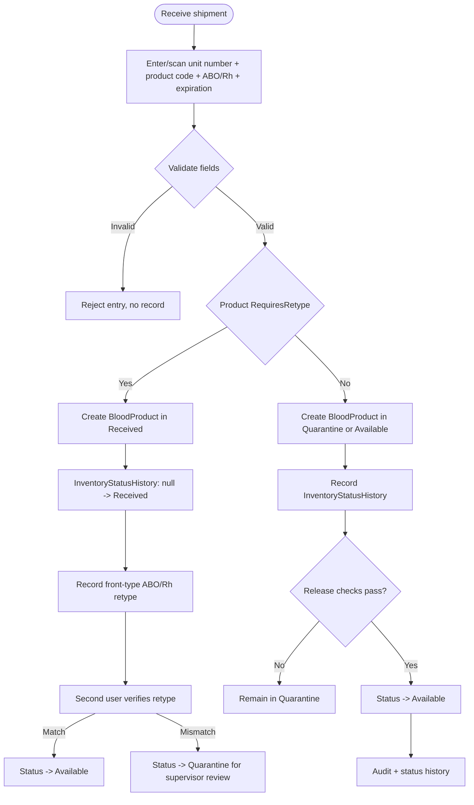
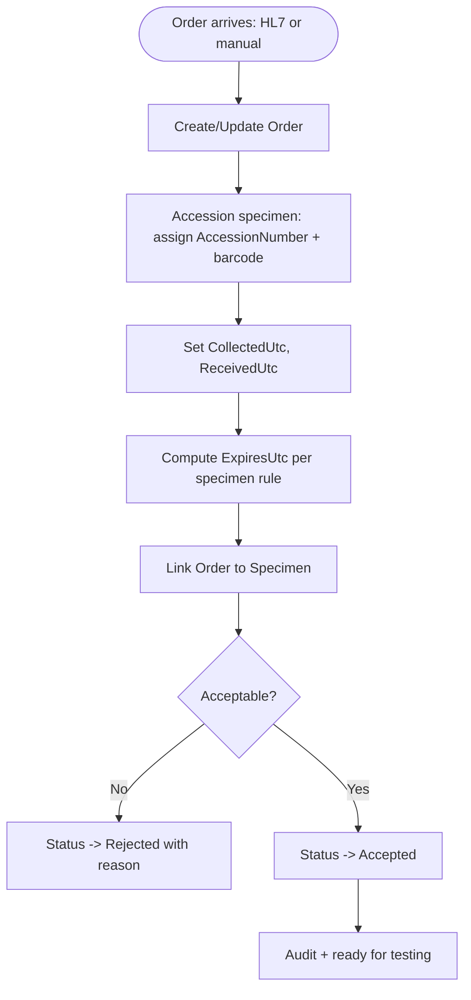
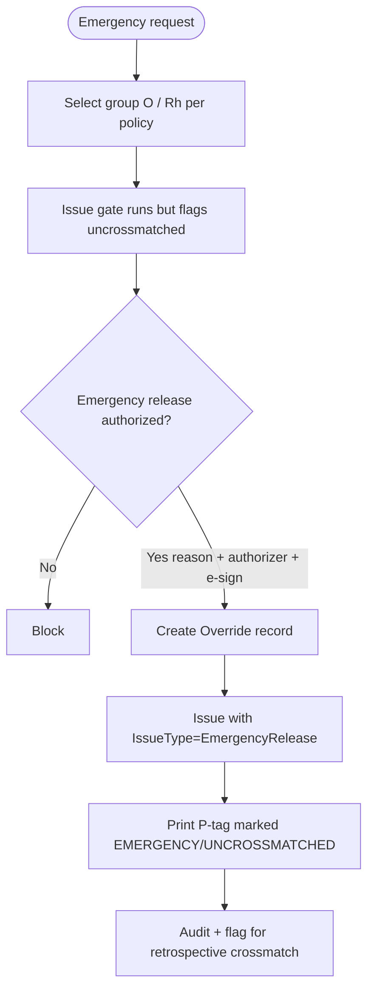
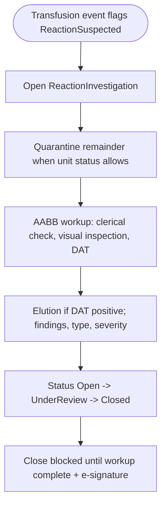
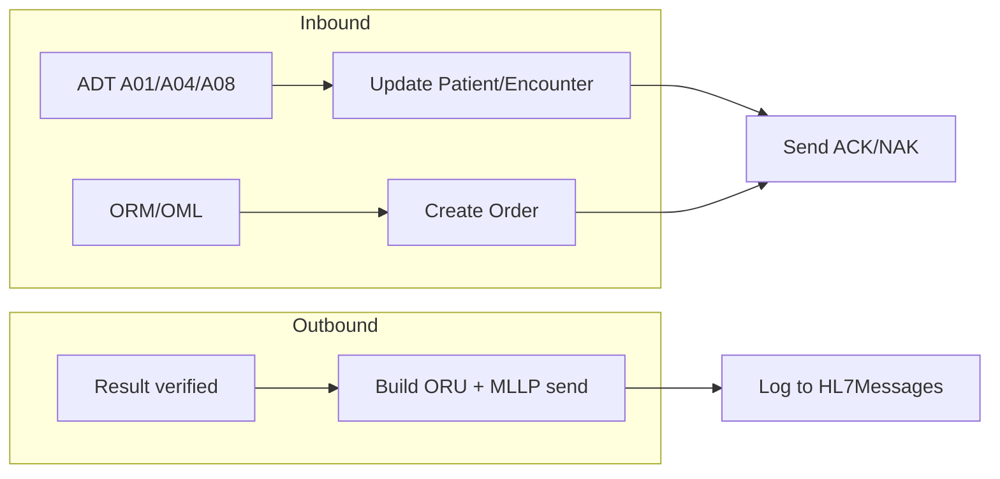

# Blood Bank LIS — Key Workflows

Status: Phase 0 (design). Each workflow names the use case(s), the safety checks invoked (see `safety-rules.md`), the state changes, and the audit events produced. Every clinical state change writes to its append-only history table and an `AuditEvent` in the same transaction.

Status legend for blood units: `Expected -> Received (retype required) or Quarantine -> Available -> Allocated -> Issued -> Transfused`, with side states `OnHold` (operational), `Missing` (inventory discrepancy), `Damaged` (container integrity), `Returned` (ward), `ReturnedToSupplier` (consignee/vendor), `Discarded`, `Expired`.

---

## 1. Unit intake (receiving)



- Use case: `ExpectUnitAsync` (packing-list / ASN), `ReceiveExpectedUnitAsync`, `CancelExpectedUnitAsync`, `ReceiveUnitCommand` (walk-in), `ReleaseUnitFromQuarantineCommand`, `RecordProductRetype`. Walk-in receive, expected-arrival confirmation, normalized-component intake, ISBT scan-session complete, and manual entry require `inventory.receive` (`INV-RCV-PERM`) in the Application service. Saving a unit antigen or antibody attribute (`POST /api/inventory/units/{id}/blood-attributes`) requires the same privilege (`INV-ATTR-PERM`).
- Expected inbound (SoftBank/SafeTrace consignee receipt): `POST /api/inventory/units/expected` creates `Expected` without visual inspection and sets `ExpectedArrivalDueUtc` from `Inventory.ExpectedArrivalDueHours` (default 24). Application requires `inventory.receive` (`INV-EXPECT-PERM`). The expected worklist (`GET /api/inventory/units/expected`) flags overdue packing lists (`INV-EXPECT-OVERDUE`). Confirm arrival (`receive-expected`) applies `INV-RCV-VISUAL` and lands in `Received` (retype) or `Quarantine`; late arrival is still allowed and is audited as late. Cancel moves to `CancelledAssignment` and requires `inventory.receive` (`INV-EXPECT-CXL-PERM`). Walk-in receive remains available for units that arrive without a prior packing list.
- Products with Retype Y start in `Received`. ISBT "Release to Available" is ignored until a matching retype is verified.
- Front-type retype: Anti-A and Anti-B always; Anti-D required only when the unit is labeled Rh negative.
- Recording a retype leaves the unit `Received` (`Entered`) and requires `result.enter` (`RES-ENTER-PERM`). Verify (`POST /api/inventory/units/{id}/retype/{resultId}/verify`) requires `result.verify` (`RES-VERIFY-PERM`) and applies `RES-SELF-VERIFY` when `Inventory.BlockRetypeSelfVerify` is on (default). Matching verify: `Received -> Available`. Mismatch: `Received -> Quarantine` with the discrepancy as the reason (supervisor uses existing release).
- Checks: unit number unique; expiration in the future; product type known; ABO/Rh present; coded appearance Acceptable (`INV-RCV-APPEAR` / `INV-RCV-VISUAL`; policy `Inventory.RequireReceiveVisualInspection`, default true); shipping-container temperature in 1–10 °C (`INV-RCV-TEMP`; policy `Inventory.RequireReceiveTemperature`, default true); autologous/directed recipient designated (`INV-AUTO-DIR`); distinct directory second verifier (`INV-RCV-2ND`; policy `Inventory.RequireReceiveVerifier`, default true). Defects (clots, hemolysis, leaking, …) and out-of-range temperatures are not received — return the unit to the supplier. Expect-unit (packing list) does not require visual, temperature, or a second verifier until arrival is confirmed; autologous/directed still require the intended recipient on the packing list.
- Quarantine release (`INV-Q-RELEASE-2ND`) requires a distinct active directory user as second verifier (SoftBank/SafeTrace quality release). Policy: `Inventory.RequireQuarantineReleaseVerifier` (default true). Application also requires `inventory.release` (`INV-REL-PERM`).
- Operational hold (`POST /api/inventory/units/{id}/hold`) is administrative, not quality quarantine. Release from hold (`/release-hold`) requires `inventory.release` in the Application service (`INV-HOLD-PERM`) and returns the unit to Available.
- Discard (`INV-DISC-2ND`) requires a distinct active directory user as second verifier (SoftBank/SafeTrace dual control to destroy a unit). Policy: `Inventory.RequireDiscardVerifier` (default true). Application also requires `inventory.discard` (`INV-DISC-PERM`).
- Location transfer (`POST /api/inventory/units/{id}/transfer`) requires `inventory.transfer` (`INV-XFER-PERM`) in the Application service.
- Missing (`POST /api/inventory/units/{id}/missing`) records a physical-inventory discrepancy. Locate (`/locate`) returns the unit to `Quarantine` for inspection — not directly to Available (AABB 21 CFR 606.165). Application locate requires `inventory.release` (`INV-LOC-PERM`).
- Damaged (`POST /api/inventory/units/{id}/damaged`) records container damage found in storage or handling (distinct from receive-time appearance reject). Inspect (`/inspect-damaged`) moves the unit to `Quarantine`; discard remains available. Application inspect requires `inventory.release` (`INV-INSP-PERM`).
- Return to supplier (`POST /api/inventory/units/{id}/return-to-supplier`) closes failed consignee receipt or unused stock without destroying the unit. Distinct from cancel-expected (never arrived) and from ward `Returned`. Terminal; not issuable. Application requires `inventory.receive` (`INV-RTS-PERM`).
- Directed-to-allogeneic conversion (`POST /api/inventory/units/{id}/convert-directed`) releases an unused directed unit into volunteer inventory after `inventory.release`, a reason, and a distinct second verifier (`INV-DIR-PERM` / `INV-DIR-ALLO` / `INV-DIR-CONV-2ND`; policy `Inventory.RequireDirectedConversionVerifier`, default true). Autologous units cannot convert. Allocated/assigned/crossmatched/selected units must be released first. Clears `ReservedPatientId` and records the conversion on the unit.
- Near-expiry worklist (`GET /api/inventory/units/near-expiry`) lists on-hand units that expire within `Inventory.NearExpiryWarningHours` (default 24). SoftBank/SafeTrace FIFO outdate list. The issue gate still warns `UNIT-NEAR-EXPIRY`; the expiration sweep moves due units to Expired.
- Quality-quarantine worklist (`GET /api/inventory/units/quarantine`) lists units in `Quarantine` with a coded reason (`BloodUnit.QuarantineReasonCode`, `INV-Q-REASON`). Place in quarantine (`POST /api/inventory/units/{id}/quarantine`) requires a catalog code; Other needs notes. Intake, locate, inspect, retype, failed return, reaction remainder, and modifications set the matching code.
- Inventory discrepancy worklist (`GET /api/inventory/units/discrepancy`) lists `Missing` and `Damaged` units awaiting locate or inspect (SoftBank/SafeTrace physical inventory; 21 CFR 606.165).
- Audit: `Create` (unit), `Update` (status change) with location.

---

## 2. Specimen accessioning and order linkage



- Use cases: `CreateOrderCommand`, `AccessionSpecimenCommand`, `LinkOrderSpecimenCommand`, `RejectSpecimenCommand`.
- Checks: patient identity resolved; collection date/time present and not in the future; specimen type valid.
- Accession requires `specimen.accession` (`SPEC-ACC-PERM`). Editing collection metadata requires `specimen.edit` (`SPEC-EDIT-PERM`). Rejecting a specimen requires `specimen.reject` (`SPEC-REJ-PERM`) in the Application service.
- Expiration: computed from policy (e.g. type-and-screen specimen valid 3 days when patient may have been transfused/pregnant; configurable in `SystemConfiguration`). See `safety-rules.md`.

---

## 3. Result entry, verification, correction


- Use cases: `EnterResultCommand`, `SubmitForVerificationCommand`, `VerifyResultCommand`, `CorrectResultCommand`, `InvalidateResultCommand`.
- Patient ABO/Rh stay `Entered` after save/complete. A second user verifies (`RES-SELF-VERIFY` when `Result.BlockAboSelfVerify` is on, default). Current type is written only on verify. The entering user cannot verify their own ABO/Rh.
- Checks: result cannot be verified by entry of unknown test; ABO/Rh discrepancy vs history (`RES-ABORH-DELTA`) blocks verify until an authorized override chooses Retain or Replace (gated by exception `MinSecurityLevel`); correcting a verified result requires reason + e-signature.
- No silent change: corrections always create a new `TestResults` version; the old row is retained and marked superseded.

---

## 4. Crossmatch, allocation, issue, transfusion (primary path)


- Use cases: `RecordCrossmatchCommand`, `AllocateUnitCommand`, `IssueUnitCommand`, `DocumentTransfusionCommand`. Allocation requires `compatibility.allocate` (`XM-ALLOC-PERM`) and recording a crossmatch requires `compatibility.crossmatch` (`XM-PERM`) in the Application service. Releasing a reservation requires `compatibility.allocate` (`XM-REL-PERM`). Issue requires `issue.create` (`ISS-CREATE-PERM`) before the issue gate. Documenting a transfusion requires `transfusion.document` (`TXN-DOC-PERM`) in the Application service. Ward receipt requires the same privilege (`TXN-WARD-PERM`).
- The **issue gate** (`safety-rules.md` section 1) runs the full check set before any unit leaves inventory.
- Electronic crossmatch path is allowed only when its preconditions are met (current ABO/Rh confirmed, negative antibody screen current/historical, no antibody history); otherwise serologic crossmatch is required (HardStop). Positive antibody screen (current or historical) or antibody history requires a complex crossmatch unless an authorized `ALLOC-XM-AB-HISTORY` override is recorded.
- Compatibility evaluation order: (1) ABO/Rh antigen/antibody conflict, (2) non-ABORH antigen-negative for RBC/WB (`ISS-ANTIGEN-NEG` Warning, supervisor+ override), (3) complex XM when indicated, (4) compatible XM required for RBC/WB.

---

## 5. Issue-to-patient gate (detail)


- After a successful issue the unit is **in transit** until ward receipt or return. Optional `CoolerId` records SoftBank-style cooler checkout. `InTransitDueUtc` is `IssuedUtc` plus `Issue.InTransitDueHours` (default 4). The issuing worklist (`GET /api/issues/in-transit`) flags overdue custody (`ISS-IN-TRANSIT`). Late ward receipt is still allowed and is audited as late. ISBT-labeled units require a fresh quadrant scan at ward receipt (`UnitScanMismatch`), matching the SoftBank remote-issue chain (issue scan → cooler → ward scan → bedside scan). Legacy units without `ComponentIdentity` are not blocked. HL7 BPAM administration stamps implicit receipt without a scan because the interface already identified the unit.
- Appearance at issue uses the same coded catalog as receive (`ISS-APPEAR`). Defects are a HardStop; the selected code is stored on `Issues.IssueAppearance`.
- Appearance at ward receipt uses the same catalog (`TX-WARD-APPEAR`). Defects are a HardStop — return the unit to the blood bank. The selected code is stored on `Issues.WardAppearance`.

---

## 6. Emergency release (uncrossmatched)



- Crossmatch-not-performed becomes an overridable Warning only inside the emergency-release workflow; outside it, missing crossmatch on a crossmatch-required product is a HardStop.
- Records `Overrides` + `ElectronicSignatures`; flags the unit/patient for retrospective compatibility testing (`TestsIncompleteAtIssue`, due date from `Issue.RetrospectiveCrossmatchDueHours`). The Issuing page lists pending follow-up until a post-issue compatible crossmatch is recorded.

---

## 7. Return to inventory


- Use case: `ReturnUnitCommand`. Stores the per-check evaluation JSON so reissue decisions are auditable. Returning an issued unit requires `issue.return` (`ISS-RET-PERM`) in the Application service.

---

## 8. Discard


- Dangerous action: requires reason, confirmation, audit. Discarded units are excluded from all selection queries. Discarding a unit requires `inventory.discard` (`INV-DISC-PERM`) in the Application service.

---

## 8a. Product modification (divide / pool / irradiate / thaw / volume-reduce / leukoreduce)

```mermaid
flowchart TD
    admin["Admin: ModificationRules + ExpirationModificationCodes\n(code, source product, type, target product, expiration code)"] --> eligible
    tech["Technologist selects source unit(s)"] --> eligible["GET eligible-modifications\n(active rules matching unit's product)"]
    eligible --> guard["UnitModificationEligibilityRule:\nstatus=Available, unexpired, product match;\nPool: >=2 sources + same product/ABO/Rh;\nDivide: >=2 result units, volumes <= source"]
    guard -->|HardStop| blocked[422 blocked, hardStops/warnings]
    guard -->|Pass| execute[Compute ResultExpiresUtc via\nModificationExpirationRule, capped at\nearliest source ExpiresUtc]
    execute --> source[Source unit(s) -> Modified\n+ InventoryStatusHistory]
    execute --> result[Result unit(s) created -> Quarantine\n+ DerivedFromModificationId]
    execute --> header[UnitModification header +\nUnitModificationUnit link rows]
    execute --> audit[Audit: Modify]
```

- Use cases: `DivideAsync`, `PoolAsync`, `ApplySingleAsync` (`BloodProductModificationService`).
- Every modification retires its source unit(s) into the terminal `Modified` status and creates new result unit(s) in `Quarantine` (new units always need release, same convention as intake) — this keeps 1→N (Divide), N→1 (Pool), and 1→1 (Irradiate/Thaw/Volume Reduction/Leukoreduction) on one execution path.
- Checks: source unit(s) `Available`, unexpired, and on the modification rule's source product; Pool additionally requires ≥2 sources with identical product/ABO/Rh (`MOD-POOL-ABO-MISMATCH` otherwise); Divide requires ≥2 result units and (if volumes are supplied) their sum must not exceed the source's volume.
- Expiration: `ResultExpiresUtc = min(anchor + offset, earliest source ExpiresUtc)` — the expiration modification code supplies the offset and whether the anchor is the modification date/time or the earliest source collection date/time. A result can never outlive its source(s), including the shortest-lived component pooled in. Collection-relative codes hard-stop (`MOD-COLLECTION-REQUIRED`) when a source has no collection timestamp.
- Dangerous action: requires a reason; records `AuditEventType.Modify` in addition to the automatic Create/Update audit on every touched/created row. Application requires `inventory.modify` (`INV-MOD-PERM`). The rules table itself is gated by `admin.modification-rules.manage`.

---

## 9. Reaction investigation



- Opening from a suspected transfusion is an automatic issue-path write. Updating the investigation, recording CBER notification, or recording the written fatality report requires `reaction.investigate` (`RXN-PERM`) in the Application service.

Creating or closing a quality-system deviation requires `deviation.manage` (`DEV-PERM`) in the Application service.

---

## 10. HL7 message flows



- Inbound messages are persisted to `HL7Messages` first, then parsed, then mapped to Application commands (which run the same safety checks as the API). Failures go to `InterfaceErrorQueue` and produce a NAK.
- Patient name, date of birth, and sex can also be edited on the patient record. Application requires `patient.write` (`PAT-WRITE-PERM`). Creating a patient requires the same privilege (`PAT-CREATE-PERM`). MRN stays immutable after create. A later ADT A08 may overwrite those demographic fields through the HL7 processor (not `PatientService`). ADT patient insert also bypasses `PatientService`.
- Manual merge of a duplicate into the surviving record requires `patient.merge` (Supervisor and Administrator by default). A reason is required. History is reassigned, not deleted. ADT A18/A40 merge is an interface action, not this HTTP permission.
- Detailed mapping, ACK/NAK, retry, and replay are specified in `hl7-design.md`.

---

## 11. Audit and signature touchpoints (summary)

| Workflow | Audit event(s) | E-signature required |
|---|---|---|
| Unit intake/release | Create, Update(status) | No |
| Accessioning/reject | Create, Update(status), Update(metadata) | No |
| Result verify | Verify | Per policy |
| Result correction | Correct | Yes |
| Allocation | Update(status) | No |
| Issue (standard) | Issue | No (unless override) |
| Issue (emergency release) | Issue, Override | Yes |
| Warning override | Override | Yes |
| Return | Return, Update(status) | No |
| Discard | Discard, Update(status) | Confirmation + reason |
| Product modification | Modify, Create/Update(status) | Reason |
| Patient demographics edit | Update | No |
| ABO/Rh manual edit | Update(blood type history) | Yes |
| P-tag reprint | Reprint | Reason |
